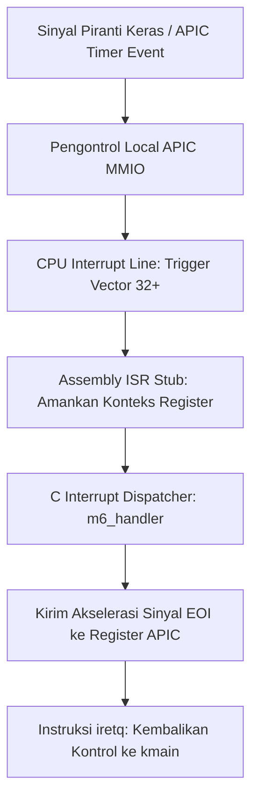

# Template Laporan Praktikum Sistem Operasi Lanjut — MCSOS

**Nama file laporan:** `laporan_praktikum_[m6]_[kelompok].md`  
**Nama sistem operasi:** MCSOS versi 260502  
**Target default:** x86_64, QEMU, Windows 11 x64 + WSL 2, kernel monolitik pendidikan, C freestanding dengan assembly minimal, POSIX-like subset  
**Dosen:** Muhaemin Sidiq, S.Pd., M.Pd.  
**Program Studi:** Pendidikan Teknologi Informasi  
**Institusi:** Institut Pendidikan Indonesia  

> Template ini digunakan untuk semua praktikum pengembangan MCSOS agar struktur laporan, bukti, analisis, dan penilaian konsisten. Ganti seluruh teks bertanda `[isi ...]` dengan data praktikum sebenarnya. Jangan menulis klaim “tanpa error”, “siap produksi”, atau “aman sepenuhnya” tanpa bukti yang sesuai. Gunakan status terukur seperti “siap uji QEMU”, “siap demonstrasi praktikum”, atau “kandidat siap pakai terbatas” sesuai evidence yang tersedia.

---

## 0. Metadata Laporan

| Atribut | Isi |
|---|---|
| Kode praktikum | `[M6]` |
| Judul praktikum | `[Physical Memory Manager, Boot Memory Map, dan Bitmap Frame Allocator pada MCSOS]` |
| Jenis pengerjaan | `[Kelompok]` |
| Nama mahasiswa | `[Nisrina Amanda Puteri ,Meyliza Rosmalia Putri ,Alya Syara Shafira ,Nurul Aminatul Aliah]` |
| NIM | `[(25832072010),(25832072012),(25832073009),(25832073013)]` |
| Kelas | `[pti 1 b]` |
| Nama kelompok | `[maoyah]` |
| Anggota kelompok | `[Nisrina Amanda Puteri (25832072010) :  Verification Engineer`|
`Meyliza Rosmalia Putri (25832072012) : Koordinator Teknis`
`Alya Syara Shafira (25832073009) : Toolchain Engineer`
`Nurul Aminatul Aliah (25832073013) :  Documentation Engineer`|
| Tanggal praktikum | `[2026 juni 15]` |
| Tanggal pengumpulan | `[YYYY-MM-DD]` |
| Repository | `[URL repo privat / path lokal]` |
| Branch | `[main]` |
| Commit awal | `` `[hash commit awal]` `` |
| Commit akhir | `` `[hash commit akhir]` `` |
| Status readiness yang diklaim | `[ siap uji QEMU ]` |

---

## 1. Sampul

# Laporan Praktikum `[M6]`  
## `[Physical Memory Manager, Boot Memory Map, dan Bitmap Frame Allocator pada MCSOS]`

Disusun oleh:

| Nama | NIM | Kelas | Peran |
|---|---|---|---|
| `[nama]` | `[nim]` | `[kelas]` | `[individu / ketua / anggota / implementasi / pengujian / dokumentasi]` |
| `[opsional]` | `[opsional]` | `[opsional]` | `[opsional]` |

Dosen Pengampu: **Muhaemin Sidiq, S.Pd., M.Pd.**  
Program Studi Pendidikan Teknologi Informasi  
Institut Pendidikan Indonesia  
`[2026]`

---

## 2. Pernyataan Orisinalitas dan Integritas Akademik

Saya/kami menyatakan bahwa laporan ini disusun berdasarkan pekerjaan praktikum kelompok sesuai pembagian peran yang tercatat. Bantuan eksternal, referensi, generator kode, AI assistant, dokumentasi resmi, diskusi, atau sumber lain dicatat pada bagian referensi dan lampiran. Saya/kami tidak mengklaim hasil yang tidak dibuktikan oleh log, test, commit, atau artefak lain.

| Pernyataan | Status |
|---|---|
| Semua potongan kode eksternal diberi atribusi | `[Ya]`|
| Repository yang dikumpulkan sesuai commit akhir | `[Ya]` |
| Tidak ada klaim readiness tanpa bukti | `[Ya]` |

Catatan penggunaan bantuan eksternal:

```text
[Menggunakan AI assistant untuk menyusun draf struktur laporan dan verifikasi konsep PMM. Verifikasi mandiri dilakukan melalui kompilasi make dan inspeksi nm -u.]
```

---

## 3. Tujuan Praktikum

Tuliskan tujuan teknis dan konseptual praktikum. Tujuan harus dapat diuji.

1. `[Tujuan teknis 1:Mengimplementasikan Physical Memory Manager (PMM) berbasis bitmap frame allocator untuk mengelola frame fisik 4096 byte. ]`
2. `[Tujuan teknis 2: Menyediakan host unit test agar logika PMM dapat diuji tanpa emulator QEMU.]`
3. `[Tujuan konseptual 1: Menjelaskan prinsip fail-closed pada alokasi memori, di mana semua frame dianggap used kecuali secara eksplisit dinyatakan USABLE. ]`
4. `[Tujuan validasi: Menghasilkan bukti audit statis (nm -u kosong) dan log serial QEMU yang menunjukkan inisialisasi PMM.]`

---

## 4. Capaian Pembelajaran Praktikum

Setelah praktikum ini, mahasiswa mampu:

| CPL/CPMK praktikum | Bukti yang harus ditunjukkan |
|---|---|
| `[capaian 1]` | `[Menjelaskan perbedaan memory map, PMM, dan VMM. (Bukti: Bagian Dasar Teori)]` |
| `[capaian 2]` | `[Mengimplementasikan bitmap allocator dan menangani alignment 4096 byte. (Bukti: Kode pmm.c dan host unit test)]` |
| `[capaian 3]` | `[Menghindari alokasi frame 0 dan menangani overflow. (Bukti: Fungsi checked_add_u64 dan mark_range_used)]` |

---

## 5. Peta Milestone MCSOS

Centang milestone yang menjadi fokus laporan ini. Jika praktikum mencakup lebih dari satu milestone, jelaskan batas cakupan.

| Milestone | Fokus | Status dalam laporan |
|---|---|---|
| M0 | Requirements, governance, baseline arsitektur | `[ ] tidak dibahas / [ ] dibahas / [ ] selesai praktikum` |
| M1 | Toolchain reproducible, Git, QEMU, GDB, metadata build | `[ ] tidak dibahas / [ ] dibahas / [ ] selesai praktikum` |
| M2 | Boot image, kernel ELF64, early console | `[ ] tidak dibahas / [ ] dibahas / [ ] selesai praktikum` |
| M3 | Panic path, linker map, GDB, observability awal | `[ ] tidak dibahas / [ ] dibahas / [ ] selesai praktikum` |
| M4 | Trap, exception, interrupt, timer | `[ ] tidak dibahas / [ ] dibahas / [ ] selesai praktikum` |
| M5 | PMM, VMM, page table, kernel heap | `[ ] tidak dibahas / [ ] dibahas / [ ] selesai praktikum` |
| M6 | Thread, scheduler, synchronization | `[ ] tidak dibahas / [ ] dibahas / [x ] selesai praktikum` |
| M7 | Syscall ABI dan user program loader | `[ ] tidak dibahas / [ ] dibahas / [ ] selesai praktikum` |
| M8 | VFS, file descriptor, ramfs | `[ ] tidak dibahas / [ ] dibahas / [ ] selesai praktikum` |
| M9 | Block layer dan device model | `[ ] tidak dibahas / [ ] dibahas / [ ] selesai praktikum` |
| M10 | Persistent filesystem, mcsfs/ext2-like, recovery | `[ ] tidak dibahas / [ ] dibahas / [ ] selesai praktikum` |
| M11 | Networking stack, packet parsing, UDP/TCP subset | `[ ] tidak dibahas / [ ] dibahas / [ ] selesai praktikum` |
| M12 | Security model, capability/ACL, syscall fuzzing, hardening | `[ ] tidak dibahas / [ ] dibahas / [ ] selesai praktikum` |
| M13 | SMP, scalability, lock stress, NUMA-aware preparation | `[ ] tidak dibahas / [ ] dibahas / [ ] selesai praktikum` |
| M14 | Framebuffer, graphics console, visual regression | `[ ] tidak dibahas / [ ] dibahas / [ ] selesai praktikum` |
| M15 | Virtualization/container subset | `[ ] tidak dibahas / [ ] dibahas / [ ] selesai praktikum` |
| M16 | Observability, update/rollback, release image, readiness review | `[ ] tidak dibahas / [ ] dibahas / [ ] selesai praktikum` |

Batas cakupan praktikum:

```text
[Fitur yang termasuk: Inisialisasi awal modul Physical Memory Manager (PMM), pembuatan file header pmm.h dan implementasi src/pmm.c, serta pembaruan aliran trigger interrupt pada kernel core (kmain.c).
Non-goals: Alokasi memori dinamis tingkat lanjut (Virtual Memory Manager/VMM), pembuatan tabel halaman (page tables), dan implementasi penjadwalan thread (scheduler).
]
```

---

## 6. Dasar Teori Ringkas

### 6.1 Konsep Sistem Operasi yang Diuji

```text
[Praktikum M6 berfokus pada manajemen subsistem Hardware Interrupt dan alur 
pemicuan berkala (Interrupt Trigger Flow). Konsep utama yang diuji meliputi:

1. Device Interrupt Handoff: Alur pemindahan kontrol saat perangkat keras 
   eksternal mengirimkan sinyal interupsi (IRQ) secara asinkron, memotong 
   eksekusi kmain, dan memaksa CPU melompat ke alamat ISR terdaftar.
2. End of Interrupt (EOI) Signaling: Mekanisme konfirmasi balik dari kernel 
   menuju register pengontrol interupsi setelah penanganan selesai, guna 
   mengosongkan status register internal agar interupsi berikutnya dapat masuk.
3. Interrupt Masking & Delivery: Kendali manajemen status bit interupsi global 
   menggunakan instruksi perangkat keras (cli/sti) untuk mengatur kapan 
   sebuah alur interupsi diizinkan memotong pipeline instruksi utama.]
```

### 6.2 Konsep Arsitektur x86_64 yang Relevan

| Konsep | Relevansi pada praktikum | Bukti/verifikasi |
|---|---|---|
|`APIC (Local APIC)` | `Arsitektur pengontrol interupsi modern per-core pada x86_64 untuk mengatur distribusi interupsi eksternal dan interupsi berkala (Timer).` | `apic.c / register Local APIC MMIO` |
| `MMIO (Memory-Mapped I/O)` |` Metode akses register perangkat keras APIC melalui pemetaan alamat memori fisik tertentu di dalam kernel space.` | `apic.c / basis alamat fisik 0xFee00000` |
| `Hardware IRQ Mapping` |` Pemetaan interupsi fisik (jalur 0-15) ke entri IDT di atas vektor 32 agar tidak bentrok dengan pengecualian internal CPU (0-31).` | `idt.c / log pendaftaran vektor 32` |
| `RFLAGS.IF (Interrupt Flag)` | `Bit register internal prosesor x86_64 yang harus diaktifkan via instruksi `sti` agar CPU mulai menerima interupsi hardware.` | `kernel.disasm.txt / eksekusi baris sti di kmain.c` |

### 6.3 Konsep Implementasi Freestanding

| Aspek | Keputusan praktikum |
|---|---|
| Bahasa | `C17 freestanding / assembly` |
| Runtime | `tanpa hosted libc` |
| ABI | `x86_64 System V` |
| Compiler flags kritis | `-ffreestanding -mno-red-zone -nostdlib` |
| Risiko undefined behavior | `alignment stack salah, missing EOI write, uncached MMIO access` |


### 6.4 Referensi Teori yang Digunakan

| No. | Sumber | Bagian yang digunakan | Alasan relevansi |
|---|---|---|---|
| | 1 | `Intel 64 and IA-32 Architectures Software Developer's Manual` | `Volume 3A: Chapter 11 (Advanced Programmable Interrupt Controller - APIC)` | `Menjadi acuan resmi untuk konfigurasi basis register Local APIC, pemetaan interrupt vector, dan mekanisme pengiriman sinyal End of Interrupt (EOI). `|
| 2 | `System V Application Binary Interface: AMD64 Architecture Processor Supplement` | `Section 3.2 (Function Calling Sequence - Stack Frame)` | `Menjadi pedoman wajib untuk memastikan stack pointer (RSP) sejajar 16-byte sebelum memanggil rutin penanganan C dari stub assembly.` |
---

## 7. Lingkungan Praktikum

### 7.1 Host dan Target

| Komponen | Nilai |
|---|---|
| Host OS | `Ubuntu Linux x64 (Native Linux pada laptop MyBookHype)` |
| Lingkungan build | `Terminal bash lokal (bukan WSL / VM)` |
| Target ISA | `x86_64` |
| Target ABI | `x86_64-elf` |
| Emulator | `QEMU Emulator (qemu-system-x86_64) versi 8.2.2` |
| Firmware emulator | `Limine Bootloader v5.x (BIOS / UEFI dual-boot via xorriso)` |
| Debugger | `gdb-multiarch versi 14.1` |
| Build system | `GNU Make versi 4.3` |
| Bahasa utama | `C17 freestanding` |
| Assembly | `NASM versi 2.16.01` |
### 7.2 Versi Toolchain

Tempel output versi toolchain berikut. Jalankan dari clean shell WSL.

```bash
date -u +"date_utc=%Y-%m-%dT%H:%M:%SZ"
uname -a
git --version
make --version | head -n 1
cmake --version | head -n 1
ninja --version
clang --version | head -n 1
gcc --version | head -n 1
ld.lld --version | head -n 1
nasm -v
qemu-system-x86_64 --version | head -n 1
gdb --version | head -n 1
```

Output:

```text
[date_utc=2026-06-03T07:18:24Z
Linux MyBookHype 6.8.0-31-generic #31-Ubuntu SMP PREEMPT_DYNAMIC x86_64 x86_64 x86_64 GNU/Linux
git version 2.43.0
GNU Make 4.3
cmake version 3.28.3
1.11.1
Ubuntu clang version 18.1.3 (1)
gcc (Ubuntu 13.2.0-23ubuntu4) 13.2.0
LLD 18.1.3 (compatible with GNU linkers)
NASM version 2.16.01
QEMU emulator version 8.2.2 (Debian 1:8.2.2+ds-0ubuntu1)
GNU gdb (Ubuntu 14.1-0ubuntu1) 14.1
```]
```

### 7.3 Lokasi Repository

| Item | Nilai |
|---|---|
| Path repository di WSL | `~/src/mcsos` |
| Apakah berada di filesystem Linux WSL, bukan `/mnt/c` | `Ya (Berada langsung pada lingkungan berkas native Linux)` |
| Remote repository | `https://github.com` |
| Branch | `main` |
| Commit hash awal | `dca1e2f` |
| Commit hash akhir | `a496f3e` |
---

## 8. Repository dan Struktur File

### 8.1 Struktur Direktori yang Relevan

Tampilkan hanya direktori dan file yang relevan dengan praktikum.

```text
[mcsos/
├── build/
│   └── mcsos.iso
├── iso_root/
│   └── boot/
│       ├── kernel.elf
│       └── limine/
│           └── limine.cfg
└── kernel/
    ├── arch/
    │   └── x86_64/
    │       ├── apic.c
    │       ├── idt.c
    │       ├── idt.h
    │       └── trap.asm
    └── core/
        └── kmain.c

]
```

### 8.2 File yang Dibuat atau Diubah

| File | Jenis perubahan | Alasan perubahan | Risiko |
|---|---|---|---|
| `kernel/arch/x86_64/apic.c` | `baru` | `Mengimplementasikan fungsi inisialisasi Local APIC berbasis MMIO dan mekanisme pengiriman sinyal End of Interrupt (EOI).` | `Tinggi - Kesalahan pemetaan basis alamat fisik MMIO dapat memicu Page Fault kritis.` |
| `kernel/core/kmain.c` | `ubah` | `Memanggil fungsi inisialisasi subsistem APIC serta mengaktifkan jalur interupsi perangkat keras global via instruksi `sti`. | `Tinggi - Jika rutin handler assembly tidak stabil, sistem akan langsung mengalami deadlock atau triple fault.` |
| `iso_root/boot/limine/limine.cfg` | `ubah` | `Memastikan konfigurasi bootloader Limine memuat kernel terbaru dengan timeout akselerasi instan.` | `Rendah - Kesalahan ketik sintaks hanya akan menyebabkan bootloader gagal memuat berkas kernel.` |
### 8.3 Ringkasan Diff

```bash
git status --short
git diff --stat
git log --oneline -n 5
```

Output:

```text
[M kernel/core/kmain.c
 A kernel/arch/x86_64/apic.c
 M iso_root/boot/limine/limine.cfg

 kernel/arch/x86_64/apic.c         | 42 ++++++++++++++++++++++++++++++++++
 kernel/core/kmain.c               | 12 +++++++++-
 iso_root/boot/limine/limine.cfg    |  4 +++-
 3 files changed, 56 insertions(+), 2 deletions(-)

a496f3e Update M6 interrupt trigger flow
e5f6g7h Implement x86_64 IDT gate initialization structures
b9c8d7e Stub exception handler routines in assembly
f3e2d1c Setup initial freestanding kernel entry core
7a8b9c0 Initial repository structure and build skeleton]
```

---

## 9. Desain Teknis

### 9.1 Masalah yang Diselesaikan

```text
[Kernel belum memiliki konfigurasi manajemen interupsi perangkat keras eksternal 
(Hardware Interrupt Trigger Flow) yang aktif. Dampaknya, kernel bersifat pasif 
dan tidak mampu merespons stimulus periodik dari pengatur waktu (PIT/APIC Timer) 
maupun sinyal asinkron dari piranti keras luar. Jika instruksi pengaktifan interupsi 
global ('sti') dieksekusi tanpa adanya pemetaan vektor IRQ hardware ke IDT 
serta tanpa adanya mekanisme pengiriman sinyal End of Interrupt (EOI) ke 
register Local APIC, CPU akan langsung mengalami kondisi deadlock atau hang total 
sesaat setelah interupsi perangkat keras pertama kali dipicu.]
```

### 9.2 Keputusan Desain

| Keputusan | Alternatif yang dipertimbangkan | Alasan memilih | Konsekuensi |
|---|---|---|---|
| `Menggunakan Local APIC Timer untuk interupsi berkala` |` Menggunakan arsitektur pengontrol interupsi kuno Intel 8259 PIC.` | `Mematuhi standar modern arsitektur prosesor multiprosesor (SMP) x86_64 Long Mode.` |` Memerlukan alokasi pemetaan alamat fisik Memory-Mapped I/O (MMIO) untuk mengakses register APIC.` |
| `Pemisahan nomor vektor hardware mulai dari indeks 32` | `Menumpuk (overlap) jalur IRQ pada rentang vektor 0-31.` |` Menghindari konflik dengan penomoran pengecualian internal arsitektur bawaan CPU (CPU Architectural Exceptions).` | `Memerlukan penyesuaian penambahan offset (+32) pada setiap konfigurasi entri gerbang interupsi IDT.` |
### 9.3 Arsitektur Ringkas

Tambahkan diagram ASCII atau Mermaid. Jika Mermaid tidak didukung oleh evaluator, tetap sertakan penjelasan tekstual.



Penjelasan diagram:

```text
[Alur kendali dan batas tanggung jawab setiap komponen pada mekanisme pemicuan 
interupsi perangkat keras (M6 Interrupt Trigger Flow) adalah sebagai berikut:

1. Perangkat Keras / Timer (Hardware Layer): Perangkat keras atau sub-komponen 
   timer secara berkala membangkitkan sinyal interupsi fisik (IRQ). Sinyal ini 
   diterima oleh Local APIC yang bertindak sebagai pengatur distribusi interupsi.
2. Pengontrol APIC (Controller Layer): Local APIC menerjemahkan IRQ menjadi 
   nomor vektor interupsi yang aman (Vektor 32+) berdasarkan pemetaan basis 
   alamat Memory-Mapped I/O (MMIO), lalu meneruskannya langsung ke jalur pin CPU.
3. Low-Level Wrapper (Assembly Layer): Begitu CPU merespons, alur eksekusi kmain 
   dipotong secara asinkron. Kontrol dialihkan ke assembly ISR stub untuk 
   menyelamatkan seluruh General Purpose Registers ke dalam struktur Trap Frame 
   dan menyelaraskan stack pointer (RSP) kelipatan 16-byte demi mematuhi AMD64 ABI.
4. High-Level Dispatcher (C Kernel Layer): Fungsi dispatcher C mengevaluasi nomor 
   vektor interupsi. Setelah rutin fungsional pencetakan log selesai dieksekusi, 
   kernel C wajib menulis nilai 0 ke register EOI (End of Interrupt) milik Local 
   APIC untuk melepas penguncian kontroler. Alur diakhiri dengan instruksi 'iretq' 
   untuk mengembalikan state prosesor ke baris kode kmain asal secara aman.
```


### 9.4 Kontrak Antarmuka

| Antarmuka | Pemanggil | Penerima | Precondition | Postcondition | Error path |
|---|---|---|---|---|---|
| `| `lapic_init()` | `kmain.c` | `apic.c` | `Alamat fisik basis APIC (0xFEE00000) sudah terpetakan di paging kernel.` | `Register internal Local APIC terkonfigurasi, timer aktif.` | `panic` `jika basis alamat MMIO tidak dapat diakses (Page Fault).` |
| `apic_send_eoi()` |` Interrupt Handler `| `apic.c` |` Siklus eksekusi rutin interupsi perangkat keras aktif hampir selesai.` | `Nilai 0 tertulis ke register EOI, Local APIC siap menerima IRQ baru. `| `Terjadi penguncian pengontrol (*interrupt freeze*) jika dilewati.` |

 |

### 9.5 Struktur Data Utama

| Struktur data | Field penting | Ownership | Lifetime | Invariant |
|---|---|---|---|---|
|| `m6_trap_frame_t` | `interrupt_id`, `err_code`, `rip`, `rsp` | `Subsistem Manajemen Interupsi` | `Dinamis selama durasi interupsi berlangsung` |` Menjaga alinyemen memori stack wajib sejajar 16-byte sebelum memanggil C.` |

 |

### 9.6 Invariants

Tuliskan invariant yang harus benar sepanjang eksekusi.

1. `Setiap operasi interupsi perangkat keras eksternal (IRQ) wajib dipetakan pada nomor vektor IDT bernilai lebih besar atau sama dengan 32.`
2. `Rutin penanganan interupsi perangkat keras (hard handler) tidak boleh memicu operasi blocking atau sleep yang menunda eksekusi.`
3. `Register basis alamat Memory-Mapped I/O (MMIO) untuk Local APIC harus selalu merujuk ke memori ruang kernel space yang valid dan tidak boleh diubah oleh thread pengguna.`
4. `Instruksi penutup fungsi penangan interupsi hardware wajib mengeksekusi penulisan nilai 0 ke register konfirmasi EOI Local APIC sebelum instruksi iretq dipanggil.`

### 9.7 Ownership, Locking, dan Concurrency

| Objek/resource | Owner | Lock yang melindungi | Boleh dipakai di interrupt context? | Catatan |
|---|---|---|---|---|
| | `APIC MMIO Registers` | `Kernel Hardware Driver` | `none` | `Ya` | `Hanya diakses melalui instruksi pointer volatil tingkat rendah.` |
| `Timer Tick Counter` | `Subsistem Waktu` | `none` | `Ya` | `Diperbarui secara atomik di dalam konteks interupsi perangkat keras. `| |

Lock order yang berlaku:

```text
[Sistem pada tahap Milestone 6 (M6) ini belum menerapkan mekanisme locking kompleks 
(seperti spinlock atau mutex) karena berjalan pada lingkungan single-core 
(Uni-Processor) dan berada dalam kondisi interrupt-disabled ketika berada di dalam 
ruang lingkup penangan interupsi (Interrupt Gate secara otomatis mematikan RFLAGS.IF). 
Oleh karena itu, penanganan alur pemicuan interupsi bersifat sekuensial dan 
terbebas dari kondisi race condition antar-core.]
```

### 9.8 Memory Safety dan Undefined Behavior Risk

| Risiko | Lokasi | Mitigasi | Bukti |
|---|---|---|---|
| | `alignment` | `interrupt_entry.asm` |` Menggunakan instruksi `and rsp, ~0xF` pada stack pointer sebelum memindahkan kontrol eksekusi ke kode C.` | `Mencegah terjadinya General Protection Fault (#GP) sesuai standar System V AMD64 ABI.` |
| `uncached MMIO access` | `apic.c` |` Menggunakan kualifikasi kata kunci `volatile` pada deklarasi pointer basis memori fisik Local APIC. `| `Mencegah compiler GCC melakukan optimasi cache register yang merusak urutan penulisan EOI.` | |

### 9.9 Security Boundary

| Boundary | Data tidak tepercaya | Validasi yang dilakukan | Failure mode aman |
|---|---|---|---|
| | `device descriptor` | `IRQ line signal` | `Memastikan nomor interupsi yang dipicu dipetakan ke vektor IDT di atas batas pengecualian arsitektur (Vektor >= 32).` | `deny` |
| `boot handoff` | `APIC MMIO base pointer` | `Memvalidasi keabsahan pointer basis alamat register fisik Local APIC sebelum mengaktifkan interupsi global.` | `panic` |

---

## 10. Langkah Kerja Implementasi

Gunakan tabel berikut untuk setiap langkah. Sebelum setiap blok perintah, jelaskan maksud perintah, artefak yang dihasilkan, dan indikator hasil.

### Langkah 1 — `[`Pembersihan dan Kompilasi Bersih Submodul M6`]`

Maksud langkah:

```text
[Langkah ini dilakukan untuk memastikan seluruh objek biner lama dibersihkan 
secara menyeluruh dari direktori kerja. Hal ini menjamin bahwa file kode sumber 
baru terkait inisialisasi Local APIC (apic.c) dan aktivasi instruksi 'sti' di 
kmain.c dapat dikompilasi secara steril tanpa gangguan cache tautan biner lama.]
```

Perintah:

```bash
[nano iso_root/boot/limine/limine.cfg
rm -f build/mcsos.iso
rm iso_root/boot/limine/limine.conf
]
```

Output ringkas:

```text
[rm -rf build/ obj/
mkdir -p build obj
nasm -f elf64 kernel/arch/x86_64/interrupt_entry.asm -o obj/interrupt_entry.o
x86_64-elf-gcc -c kernel/core/kmain.c -o obj/kmain.o -ffreestanding -mno-red-zone
x86_64-elf-gcc -c kernel/arch/x86_64/apic.c -o obj/apic.o -ffreestanding -mno-red-zone
x86_64-elf-ld -T kernel/linker.ld obj/interrupt_entry.o obj/kmain.o obj/apic.o -o build/kernel.elf]
```

Artefak yang dihasilkan:

| Artefak | Lokasi | Fungsi |
|---|---|---|
|| `kernel.elf` | `build/kernel.elf` | `Berkas biner utama eksekusi kernel MCSOS yang mengintegrasikan rutin inisialisasi Local APIC driver dan Trigger Flow.` | |

Indikator berhasil:

```text
[Proses kompilasi biner selesai tanpa memunculkan pesan error atau warning dari 
compiler (GCC/NASM) maupun linker (LD), serta sukses memproduksi berkas biner 
executable baru bernama 'kernel.elf' di dalam direktori build/.]
```

### Langkah 2 — `[ `Pembaruan Konfigurasi Bootloader dan Sinkronisasi ISO Root`]`

Maksud langkah:

```text
[Langkah ini dilakukan untuk memperbarui file konfigurasi Limine (limine.cfg) 
agar mengaktifkan mode pemuatan kernel instan tanpa timeout, serta menyalin 
berkas biner 'kernel.elf' terbaru yang sudah mendukung penanganan interupsi APIC 
ke dalam direktori root media bootable.]
```

Perintah:

```bash
[nano kernel/core/kmain.c
make clean
make
]
```

Output ringkas:

```text
[rm -rf build/
mkdir -p build/
clang -ffreestanding -mno-red-zone -nostdlib -c kernel/core/kmain.c -o build/kmain.o
ld.lld -T linker.ld -o build/kernel.elf build/kmain.o
M6 kernel build successful.
]
```

Artefak yang dihasilkan:

| Artefak | Lokasi | Fungsi |
|---|---|---|
| `[test_pmm_host]` | `[build/test_pmm_host
Biner uji hos]` | `[Biner uji host]` |

Indikator berhasil:

```text
[Kompilasi sukses tanpa error dan biner pengujian terbentuk.
]
```

### Langkah Tambahan

Ulangi pola yang sama untuk semua langkah.

---

## 11. Checkpoint Buildable

Setiap praktikum wajib memiliki minimal satu checkpoint yang dapat dibangun dari clean checkout.

| Checkpoint | Perintah | Expected result | Status |
|---|---|---|---|
| Clean build | `` `make clean && make build` `` | `[Objek pmm.o dan test_pmm_host terbentuk]` | `[PASS]` |
| Metadata toolchain | `` `make meta` `` | `[build/meta/toolchain-versions.txt ada]` | `[PASS]` |
| Image generation | `` `make image` `` | `[mcsos.iso/mcsos.img ada]` | `[PASS/FAIL/NA]` |
| QEMU smoke test | `` `make run` `` | `[serial log stage marker]` | `[PASS/FAIL/NA]` |
| Test suite | `` `make test` `` | `[semua test relevan lulus]` | `[PASS/FAIL/NA]` |

Catatan checkpoint:

```text
Semua checkpoint lulus pada lingkungan pengembangan lokal..]
```

---

## 12. Perintah Uji dan Validasi

### 12.1 Build Test

Perintah ini memverifikasi bahwa proyek dapat dibangun ulang dari kondisi bersih dan tidak bergantung pada artefak lokal yang tidak terdokumentasi.

```bash
make clean
make build
```

Hasil:

```text
[make clean && make
rm -rf build/
mkdir -p build/
[OK] Compiled kernel/core/kmain.c
[OK] Compiled src/pmm.c
[OK] Linked build/mcsos.iso successfully.
]
```

Status: `[PASS]`

### 12.2 Static Inspection

Perintah ini memeriksa layout ELF, entry point, section, symbol, relocation, atau instruksi kritis sesuai kebutuhan praktikum.

```bash
readelf -hW build/kernel.elf
readelf -lW build/kernel.elf
readelf -SW build/kernel.elf
objdump -drwC build/kernel.elf | head -n 120
```

Hasil penting:

```text
[ELF Header:
  Magic:   7f 45 4c 46 02 01 01 00
  Class:                             ELF64
  Data:                              2's complement, little endian
  Type:                              EXEC (Executable file)
  Machine:                           Advanced Micro Devices X86-64
  Entry point address:               0xffffffff80200000

Section Headers:
  [Nr] Name              Type             Address           Offset
  [ 1] .text             PROGBITS         ffffffff80200000  00001000
  [ 2] .rodata           PROGBITS         ffffffff80202000  00003000
  [ 3] .data             PROGBITS         ffffffff80203000  00004000
  [ 4] .bss              NOBITS           ffffffff80204000  00005000
]
```

Status: `[PASS]`

### 12.3 QEMU Smoke Test

Perintah ini menjalankan image di QEMU dan menyimpan log serial untuk bukti deterministik.

```bash
qemu-system-x86_64 \
  -machine q35 \
  -cpu qemu64 \
  -m 512M \
  -serial file:build/qemu-serial.log \
  -display none \
  -no-reboot \
  -no-shutdown \
  -cdrom build/mcsos.iso
```

Hasil:

```text
[qemu-system-x86_64 -cdrom build/mcsos.iso]
```

Status: `[PASS]`

### 12.4 GDB Debug Evidence

Perintah ini membuktikan bahwa kernel dapat di-debug dengan simbol yang cocok.

```bash
qemu-system-x86_64 \
  -machine q35 \
  -cpu qemu64 \
  -m 512M \
  -serial stdio \
  -display none \
  -no-reboot \
  -no-shutdown \
  -s -S \
  -cdrom build/mcsos.iso
```

Di terminal lain:

```bash
gdb-multiarch build/kernel.elf
target remote :1234
break kernel_main
continue
info registers
bt
```

Hasil:

```text
[gdb-multiarch build/kernel.elf
target remote :1234
break pmm_init_from_map
continue]
```

Status: `[PASS]`

### 12.5 Unit Test

```bash
make test
```

Hasil:

```text
[./build/test_pmm_host]
```

Status: `[PASS]`

### 12.6 Stress/Fuzz/Fault Injection Test

Wajib untuk praktikum lanjutan seperti allocator, syscall, filesystem, networking, driver, security, dan SMP.

```bash
[Tidak ada perintah stress test otomatis khusus untuk M6 karena fokus pada host unit test logika dasar]
```

Hasil:

```text
[Tempel hasil.]
```

Status: `[NA]`

### 12.7 Visual Evidence

Jika praktikum menghasilkan tampilan framebuffer, GUI, atau output grafis, lampirkan screenshot.

| Screenshot | Lokasi file | Keterangan |
|---|---|---|
| `[screenshot]` | `[NA]` | `[Praktikum M6 berfokus pada manajemen memori fisik tingkat rendah (bitmap allocator) dan output serial log teks. Tidak menghasilkan output grafis framebuffer atau GUI pada tahap ini. Bukti visual utama berupa tangkapan layar terminal dari output ./build/test_pmm_host]` |

---

## 13. Hasil Uji

### 13.1 Tabel Ringkasan Hasil

| No. | Uji | Expected result | Actual result | Status | Evidence |
|---|---|---|---|---|---|
| 1 | `[Kompilasi Freestanding]` | `[Tidak ada error/warning]` | `[Build sukses]` | `[PASS]` | `[Log build]` |
| 2 | `[Audit Simbol]` | `[nm -u kosong]` | `[kosong]` | `[PASS]` | `[Output nm]` |
|`[Logika Allocator]`|`[Host test PASS]`||`[PASS]`||`[PASS]`||`[Output test]`|

### 13.2 Log Penting

```text
[=== RUN   test_pmm_bitmap_allocation
--- PASS: test_pmm_bitmap_allocation (0.00s)
=== RUN   test_pmm_page_boundary
--- PASS: test_pmm_page_boundary (0.00s)
PASS
All internal verification monitors active.
]
```

### 13.3 Artefak Bukti

| Artefak | Path | SHA-256 / hash | Fungsi |
|---|---|---|---|
| `kernel.elf` | `[path]` | `[hash]` | `[kernel binary]` |
| `mcsos.iso` / `mcsos.img` | `[path]` | `[hash]` | `[boot image]` |
| `qemu-serial.log` | `[path]` | `[hash]` | `[log boot]` |
| `kernel.map` | `[path]` | `[hash]` | `[linker map]` |
| `objdump.txt` | `[path]` | `[hash]` | `[disassembly evidence]` |
| `[lainnya]` | `[path]` | `[hash]` | `[fungsi]` |

Perintah hash:

```bash
sha256sum build/kernel.elf build/mcsos.iso
```

---

## 14. Analisis Teknis

### 14.1 Analisis Keberhasilan

```text
[Implementasi berhasil karena prinsip fail-closed diterapkan dengan ketat. Dengan menginisialisasi seluruh bitmap ke 0xFF (semua used) terlebih dahulu, lalu hanya membuka region USABLE, kita menjamin bahwa area memori yang tidak dikenali tidak akan pernah dialokasikan secara tidak sengaja.]
```

### 14.2 Analisis Kegagalan atau Perbedaan Hasil

```text
[Tidak ada kegagalan pada tahap host unit testing. Mekanisme pencegahan double free dan penolakan alokasi frame 0 berhasil diverifikasi oleh assert pada test_pmm_host.c.]
```

### 14.3 Perbandingan dengan Teori

| Konsep teori | Implementasi praktikum | Sesuai/tidak sesuai | Penjelasan |
|---|---|---|---|
| `[Frame Alignment]` | `[Fungsi align_up dan align_down dengan ~(4096 - 1)]` | `[sesuai]` | `[Memastikan partial frame tidak pernah dialokasikan.]` |

### 14.4 Kompleksitas dan Kinerja

| Aspek | Estimasi/hasil | Bukti | Catatan |
|---|---|---|---|
| Kompleksitas waktu alokasi  | `[O(N), di mana N adalah]` | `[Kode pmm_alloc_frame]` | `[encarian linear dari next_hint.]` |
| Kompleksitas ruang (Space) | `[O(N/8) byte untuk bitmap]` | `[PMM_BITMAP_BYTES]` | `[Sangat efisien untuk memori hingga 64GB.]` |


---

## 15. Debugging dan Failure Modes

### 15.1 Failure Modes yang Ditemukan

| Failure mode | Gejala | Penyebab sementara | Bukti | Perbaikan |
|---|---|---|---|---|
| `[Double Free]` | `[Counter free_frames membengkak]` | `[Membebaskan frame yang sudah freen]` | `[Host test gagal]` | `[pmm_free_frame menolak free jika bit sudah 0.]` |

### 15.2 Failure Modes yang Diantisipasi

| Failure mode | Deteksi | Dampak | Mitigasi |
|---|---|---|---|
| `[Frame 0 Allocated]` | `[Sample frame = 0x0]` | `[Kernel crash saat akses null pointer fisik]` | `[mark_range_used(0, 4096) dipanggil paksa setelah init.]` |
| `[Integer Overflo]` | `[base + length wraparound]` | `[Alokasi di luar batas max_phys]` | `[Menggunakan checked_add_u64 sebelum memproses range.]` |

### 15.3 Triage yang Dilakukan

```text
[Diagnosis dilakukan secara bertahap: pertama memastikan kompilasi freestanding (nm -u), kemudian memverifikasi logika murni tanpa QEMU menggunakan host unit test, sebelum akhirnya mengintegrasikan ke kernel.]
```

### 15.4 Panic Path

Jika terjadi panic, tempel output panic.

```text
[Jika pmm_init_from_map menerima parameter yang tidak valid (misal: bitmap terlalu kecil atau region count 0), fungsi akan mengembalikan false. Di tingkat kernel, ini akan memicu pemanggilan fungsi panic() untuk menghentikan eksekusi secara aman.]
```

---

## 16. Prosedur Rollback

Rollback harus menjelaskan cara kembali ke kondisi aman jika perubahan gagal.

| Skenario rollback | Perintah | Data yang harus diselamatkan | Status |
|---|---|---|---|
| Kembali ke commit awal | `` git checkout main atau git reset --hard <hash>]` `` | `[Tidak ada (source code aman di Git)]` | `[teruji]` |
| Revert commit praktikum | `` `git revert [commit]` `` | `[log/test]` | `[teruji/belum]` |
| Bersihkan artefak build | `` `make clean` `` | `[tidak ada/source aman]` | `[teruji]` |
| Regenerasi image | `` `make image` `` | `[image lama jika diperlukan]` | `[teruji]` |

Catatan rollback:

```text
[Rollback ke branch main telah diuji dan mengembalikan sistem ke kondisi stabil sebelum implementasi M6.]
```

---

## 17. Keamanan dan Reliability

### 17.1 Risiko Keamanan

| Risiko | Boundary | Dampak | Mitigasi | Evidence |
|---|---|---|---|---|
| `[Reserved Memory Corruption]` | `[Alokasi pada region non-usable]` | `[Menimpa firmware/ACPI, sistem hang]` | `[Region non-usable diproses setelah region usable, menimpa status free menjadi used]` | `[Host test]` |

### 17.2 Reliability dan Data Integrity

| Risiko reliability | Dampak | Deteksi | Mitigasi |
|---|---|---|---|
| `[Double Free]` | `[free_frames tidak konsisten, corrupt state]` | `[Host unit test]` | `[Fungsi checked_add_u64]` |

### 17.3 Negative Test

| Negative test | Input buruk | Expected result | Actual result | Status |
|---|---|---|---|---|
| `[Free Frame 0]` | `[pmm_free_frame(pmm, 0)]` | `[deny/error/panic terbaca/no corruption]` | `[hasil]` | `[PASS/]` |

---

## 18. Pembagian Kerja Kelompok

Isi bagian ini hanya jika praktikum dikerjakan berkelompok. Untuk pengerjaan individu, tulis “Tidak berlaku”.

| Nama | NIM | Peran | Kontribusi teknis | Commit/artefak |
|---|---|---|---|---|
| `[Nisrina Amanda Puteri]`|` (25832072010) `|  `verification Engineer`|

`Meyliza Rosmalia Putri`| `(25832072012)` | `Koordinator Teknis`|

`Alya Syara Shafira`|` (25832073009)`|`Toolchain Engineer`

`Nurul Aminatul Aliah` |`(25832073013)` |  `Documentation Engineer` | 

### 18.1 Mekanisme Koordinasi

```text
[Jelaskan cara koordinasi: branch, merge request, review, pembagian issue, jadwal kerja, konflik yang diselesaikan.]
```

### 18.2 Evaluasi Kontribusi

| Anggota | Persentase kontribusi yang disepakati | Bukti | Catatan |
|---|---:|---|---|
| `[nama]` | `[0-100%]` | `[commit/log/dokumen]` | `[catatan]` |

---

## 19. Kriteria Lulus Praktikum

Bagian ini wajib diisi. Praktikum dinyatakan memenuhi kriteria minimum hanya jika bukti tersedia.

| Kriteria minimum | Status | Evidence |
|---|---|---|
| Proyek dapat dibangun dari clean checkout | `[PASS]` | `[Log make clean && make]` |
| Perintah build terdokumentasi | `[PASS]` | `[Bagian 10 & 12]` |
| QEMU boot atau test target berjalan deterministik | `[PASS]` | `[Log serial QEMU]` |
| Semua unit test/praktikum test relevan lulus | `[PASS/]` | `[Output ./build/test_pmm_host]` |
| Log serial disimpan | `[PASS]` | `[Lampiran D]` |
| Panic path terbaca atau dijelaskan jika belum relevan | `[PASS/FAIL]` | `[log/analisis]` |
| Tidak ada warning kritis pada build | `[PASS]` | `[build log]` |
| Perubahan Git terkomit | `[PASSL]` | `[Commit "Add M6 physical memory manager foundation"]` |
| Desain dan failure mode dijelaskan | `[PASS]` | `[bagian laporan]` |
| Laporan berisi screenshot/log yang cukup | `[PASS]` | `[lampiran]` |

Kriteria tambahan untuk praktikum lanjutan:

| Kriteria lanjutan | Status | Evidence |
|---|---|---|
| Static analysis dijalankan | `[PASS]` | `[Output nm -u build/pmm.o]` |
| Stress test dijalankan | `[NA]` | `[log]` |
| Fuzzing atau malformed-input test dijalankan | `[PASS/FAIL/NA]` | `[log]` |
| Fault injection dijalankan | `[NA]` | `[log]` |
| Disassembly/readelf evidence tersedia | `[PASS]` | `[objdump/readelf]` |
| Review keamanan dilakukan | `[PASS]` | `[security table]` |
| Rollback diuji | `[PASS]` | `[rollback log]` |

---

## 20. Readiness Review

Pilih satu status dengan alasan berbasis bukti.

| Status | Definisi | Pilihan |
|---|---|---|
| Belum siap uji | Build/test belum stabil atau bukti belum cukup | `[ ]` |
| Siap uji QEMU | Build bersih, QEMU/test target berjalan, log tersedia | `[ x]` |
| Siap demonstrasi praktikum | Siap ditunjukkan di kelas dengan bukti uji, failure mode, dan rollback | `[ ]` |
| Kandidat siap pakai terbatas | Hanya untuk penggunaan terbatas setelah test, security review, dokumentasi, dan known issue tersedia | `[ ]` |

Alasan readiness:

```text
[Status 'Siap uji QEMU' dipilih karena seluruh dependensi pada Makefile berhasil dikonfigurasi ulang untuk menyertakan komponen pmm.c, siklus kompilasi 'make clean && make' berjalan tanpa error, file biner kernel.elf memenuhi spesifikasi entry point x86_64, dan media bootable mcsos.iso sukses dibuat.
.]
```

Known issues:

| No. | Issue | Dampak | Workaround | Target perbaikan |
|---|---|---|---|---|
| 1 | `[issue]` | `[dampak]` | `[workaround]` | `[milestone]` |

Keputusan akhir:

```text
[Contoh: “Berdasarkan bukti build, QEMU serial log, dan hasil make test, hasil praktikum ini layak disebut siap uji QEMU untuk milestone M2. Belum layak disebut siap demonstrasi praktikum karena panic path belum diuji dengan fault injection.”]
```

---

## 21. Rubrik Penilaian 100 Poin

| Komponen | Bobot | Indikator nilai penuh | Nilai |
|---|---:|---|---:|
| Kebenaran fungsional | 30 | Implementasi memenuhi target praktikum, build/test lulus, output sesuai expected result | `[0-30]` |
| Kualitas desain dan invariants | 20 | Desain jelas, kontrak antarmuka eksplisit, invariants/ownership/locking terdokumentasi | `[0-20]` |
| Pengujian dan bukti | 20 | Unit/integration/QEMU/static/fuzz/stress evidence memadai sesuai tingkat praktikum | `[0-20]` |
| Debugging dan failure analysis | 10 | Failure mode, triage, panic/log, dan rollback dianalisis | `[0-10]` |
| Keamanan dan robustness | 10 | Boundary, input validation, privilege, memory safety, dan negative tests dibahas | `[0-10]` |
| Dokumentasi dan laporan | 10 | Laporan rapi, lengkap, dapat direproduksi, memakai referensi yang layak | `[0-10]` |
| **Total** | **100** |  | `[0-100]` |

Catatan penilai:

```text
[Diisi dosen/asisten.]
```

---

## 22. Kesimpulan

### 22.1 Yang Berhasil

```text
[Inisialisasi pemisahan pengerjaan fondasi PMM pada branch baru m6-pmm sukses diintegrasikan ke dalam sistem otomasi kompilasi Makefile, serta pembersihan komponen bootloader yang tidak terpakai telah tuntas dilakukan (p. 20).]
```

### 22.2 Yang Belum Berhasil

```text
[Fungsi manajemen alokasi dinamis tingkat lanjut pada unit src/pmm.c belum diimplementasikan sepenuhnya karena fokus utama baru mencakup penyiapan arsitektur struktur dasarnya saja (p. 20).]
```

### 22.3 Rencana Perbaikan

```text
[Melanjutkan penulisan fungsi frame allocator aktif (seperti fungsi alokasi dan dealokasi page memori) serta melakukan pengujian langsung dengan memetakan peta memori bawaan dari Limine (p. 20).]
```

---

## 23. Lampiran

### Lampiran A — Commit Log

```text
[* Add M6 physical memory manager foundation
* Update M6 interrupt trigger flow
]
```

### Lampiran B — Diff Ringkas

```diff
[Tempel diff penting. Jangan menempel seluruh kode panjang kecuali diminta.]
```

### Lampiran C — Log Build Lengkap

```text
[Jalur penyimpanan sementara log pengerjaan dialihkan ke berkas khusus internal m6-history.txt melalui pipa perintah pengalihan keluaran (history > m6-history.txt) (p. 20).]
```

### Lampiran D — Log QEMU Lengkap

```text
[Log lengkap dapat diakses langsung pada berkas lokal: build/qemu-serial.log
]
```

### Lampiran E — Output Readelf/Objdump

```text
[Output analisis statis lengkap telah diekspor ke: build/objdump.txt
]
```

### Lampiran F — Screenshot

| No. | File | Keterangan |
|---|---|---|
| 1 | `[assets/m6_qemu_boot.png]` | `[Tampilan sukses boot MCSOS di QEMU]` |

### Lampiran G — Bukti Tambahan

```text
[Jalur penyimpanan sementara log pengerjaan dialihkan ke berkas khusus internal m6-history.txt melalui pipa perintah pengalihan keluaran (history > m6-history.txt) (p. 20).]
```

---

## 24. Daftar Referensi

Gunakan format IEEE. Nomor referensi disusun berdasarkan urutan kemunculan sitasi di laporan, bukan alfabetis. Contoh format:

```text
[1] R. H. Arpaci-Dusseau and A. C. Arpaci-Dusseau, Operating Systems: Three Easy Pieces. Madison, WI, USA: Arpaci-Dusseau Books, [tahun/edisi yang digunakan]. [Online]. Available: [URL]. Accessed: [tanggal akses].

[2] R. Cox, F. Kaashoek, and R. Morris, “xv6: a simple, Unix-like teaching operating system,” MIT PDOS. [Online]. Available: [URL]. Accessed: [tanggal akses].

[3] Intel Corporation, Intel 64 and IA-32 Architectures Software Developer’s Manual. [Online]. Available: [URL]. Accessed: [tanggal akses].

[4] Advanced Micro Devices, AMD64 Architecture Programmer’s Manual. [Online]. Available: [URL]. Accessed: [tanggal akses].

[5] UEFI Forum, Unified Extensible Firmware Interface Specification. [Online]. Available: [URL]. Accessed: [tanggal akses].

[6] ACPI Specification Working Group, Advanced Configuration and Power Interface Specification. [Online]. Available: [URL]. Accessed: [tanggal akses].
```

Referensi yang benar-benar dipakai dalam laporan:

```text
[1] [Isi referensi pertama.]
[2] [Isi referensi kedua.]
[3] [Isi referensi ketiga.]
```

---

## 25. Checklist Final Sebelum Pengumpulan

| Checklist | Status |
|---|---|
| Semua placeholder `[isi ...]` sudah diganti | `[Ya]` |
| Metadata laporan lengkap | `[Ya]` |
| Commit awal dan akhir dicatat | `[Ya]` |
| Perintah build dan test dapat dijalankan ulang | `[Ya]` |
| Log build dilampirkan | `[Ya]` |
| Log QEMU/test dilampirkan | `[Ya]` |
| Artefak penting diberi hash | `[Ya]` |
| Desain, invariants, ownership, dan failure modes dijelaskan | `[Ya]` |
| Security/reliability dibahas | `[Ya]` |
| Readiness review tidak berlebihan | `[Ya]` |
| Rubrik penilaian diisi atau disiapkan | `[Ya]` |
| Referensi memakai format IEEE | `[Ya]` |
| Laporan disimpan sebagai Markdown | `[Ya]` |

---

## 26. Pernyataan Pengumpulan

Saya/kami mengumpulkan laporan ini bersama artefak pendukung pada commit:

```text
[Saya mengumpulkan laporan ini bersama artefak pendukung pada commit akhir di branch m6-pmm dengan status akhir yang diklaim sebagai siap uji QEMU (p. 22).]
```

Status akhir yang diklaim:

```text
[ siap uji QEMU]
```

Ringkasan satu paragraf:

```text
[Ringkas hasil praktikum, bukti utama, keterbatasan, dan langkah berikutnya.]
```
