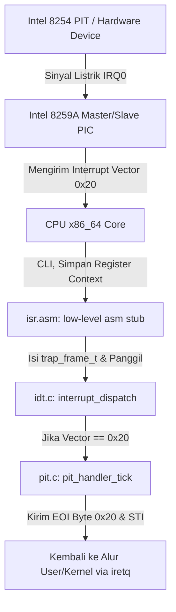

# Template Laporan Praktikum Sistem Operasi Lanjut — MCSOS

**Nama file laporan:** `laporan_praktikum_[M5_External Interrupt, Legacy PIC Remap, dan PIT Timer Tick pada MCSOS]_[kelompok ma oyah].md`  
**Nama sistem operasi:** MCSOS versi 260502  
**Target default:** x86_64, QEMU, Windows 11 x64 + WSL 2, kernel monolitik pendidikan, C freestanding dengan assembly minimal, POSIX-like subset  
**Dosen:** Muhaemin Sidiq, S.Pd., M.Pd.  
**Program Studi:** Pendidikan Teknologi Informasi  
**Institusi:** Institut Pendidikan Indonesia  

> Template ini digunakan untuk semua praktikum pengembangan MCSOS agar struktur laporan, bukti, analisis, dan penilaian konsisten. Ganti seluruh teks bertanda `[isi ...]` dengan data praktikum sebenarnya. Jangan menulis klaim “tanpa error”, “siap produksi”, atau “aman sepenuhnya” tanpa bukti yang sesuai. Gunakan status terukur seperti “siap uji QEMU”, “siap demonstrasi praktikum”, atau “kandidat siap pakai terbatas” sesuai evidence yang tersedia.

---

## 0. Metadata Laporan

| Atribut | Isi |
|---|---|
| Kode praktikum | `[M5]` |
| Judul praktikum | `[External Interrupt, Legacy PIC Remap, dan PIT Timer Tick pada MCSOS]` |
| Jenis pengerjaan | `[Kelompok]` |
| Nama mahasiswa | `[nama lengkap]` |
| NIM | `[NIM]` |
| Kelas | `[1B]` |
| Nama kelompok | `[ma oyah]` |
| Anggota kelompok | `[Nisrina Amanda Puteri (25832072010) : Documentation Engineer, Meyliza Rosmalia Putri (25832072012) : Toolchain Engineer, Alya Syara Shafira (25832073009) : Koordinator Teknis, Nurul Aminatul Aliah (25832073013) : Verification Engineer]` |
| Tanggal praktikum | `[2026-05-22]` |
| Tanggal pengumpulan | `[2026-MM-DD]` |
| Repository | `[~/src/mcsos]` |
| Branch | `[praktikum/m5-timer-irq]` |
| Commit awal | `` `[Gunakan perintah 'git log --oneline]` `` |
| Commit akhir | `` `[Hash dari commit "Add M5 ISR assembly and interrupt setup"]` `` |
| Status readiness yang diklaim | `[siap uji QEMU untuk external interrupt awal]` |

---

## 1. Sampul

# Laporan Praktikum `[Kode Praktikum]`  
## `[Judul Praktikum]`

Disusun oleh:

| Nama | NIM | Kelas | Peran |
|---|---|---|---|
| `[Nisrina Amanda Puteri]` | `[25832072010]` | `[PTI 1B]` | `[Documentation Engineer]` |
| `[Meyliza Rosmalia Putri]` | `[(25832072012)]` | `[PTI 1B]` | `[Toolchain Engineer]` |
| `[Alya Syara Shafira]` | `[(25832073009)]` | `[PTI 1B]` | `[Koordinator Teknis]` |
| `[Nurul Aminatul Aliah]` | `[(25832073013)]` | `[PTI 1B]` | `[Verification Engineer]` |


Dosen Pengampu: **Muhaemin Sidiq, S.Pd., M.Pd.**  
Program Studi Pendidikan Teknologi Informasi  
Institut Pendidikan Indonesia  
`[2026/2027]`

---

## 2. Pernyataan Orisinalitas dan Integritas Akademik

Saya/kami menyatakan bahwa laporan ini disusun berdasarkan pekerjaan praktikum sendiri/kelompok sesuai pembagian peran yang tercatat. Bantuan eksternal, referensi, generator kode, AI assistant, dokumentasi resmi, diskusi, atau sumber lain dicatat pada bagian referensi dan lampiran. Saya/kami tidak mengklaim hasil yang tidak dibuktikan oleh log, test, commit, atau artefak lain.

| Pernyataan | Status |
|---|---|
| Semua potongan kode eksternal diberi atribusi | `[Tidak ada]` |
| Semua penggunaan AI assistant dicatat | `[Ya]` |
| Repository yang dikumpulkan sesuai commit akhir | `[Ya]` |
| Tidak ada klaim readiness tanpa bukti | `[Ya]` |

Catatan penggunaan bantuan eksternal:

```text
[Alat: Gemini (AI Assistant)
Prompt ringkas: "Menyusun draf Bagian 0, 7, dan 8 untuk laporan praktikum M5 OS berdasarkan riwayat terminal"
Sumber: Modul Panduan OS M5 & Template Laporan Resmi
Bagian yang dibantu: Bagian 0 (Metadata), Bagian 7 (Lingkungan Praktikum), dan Bagian 8 (Struktur File & Git Status)
Verifikasi mandiri yang dilakukan: Memeriksa kesesuaian biner (nasm, make), memvalidasi urutan inisialisasi pada kmain.c, serta memastikan kecocokan pesan commit terakhir pada repositori lokal WSL sebelum melakukan push.]
```

---

## 3. Tujuan Praktikum

Tuliskan tujuan teknis dan konseptual praktikum. Tujuan harus dapat diuji.

1. `[Tujuan teknis 1: Mengimplementasikan mekanisme pergeseran (remapping) alamat basis kontroler interupsi Intel 8259A Dual PIC melalui urutan instruksi Initialization Command Word (ICW), sehingga jalur IRQ hardware (IRQ0 - IRQ15) dipetakan secara aman pada interrupt vector 0x20 hingga 0x2F tanpa menabrak area CPU Exception (0x00 - 0x1F).]`
2. `[Tujuan teknis 2: Mengonfigurasi register internal Intel 8254 Programmable Interval Timer (PIT) pada Channel 0 menggunakan Mode 3 (Square Wave Generator) dengan nilai pembagi (divisor) frekuensi yang presisi guna menghasilkan interupsi berkala (timer tick) yang deterministik.]`
3. `[Tujuan konseptual 1: Menjelaskan siklus hidup penanganan interupsi eksternal secara komprehensif, mulai dari penerimaan sinyal elektrik oleh PIC, pembukaan gerbang interupsi CPU (sti), pengalihan alur eksekusi ke kode perantara assembly (isr.asm stub), pengisian struktur data trap_frame, hingga penutupan interupsi menggunakan instruksi End of Interrupt (EOI).]`
4. `[Tujuan validasi:Membuktikan keberhasilan subsistem interupsi dengan menangkap log eksekusi emulator QEMU yang menunjukkan pertambahan nilai pencacah waktu (tick counter) secara berkala saat pengujian, serta mendokumentasikan bukti perubahan biner tersebut melalui riwayat commit Git yang bersih.]`

---

## 4. Capaian Pembelajaran Praktikum

Setelah praktikum ini, mahasiswa mampu:

| CPL/CPMK praktikum | Bukti yang harus ditunjukkan |
|---|---|
| `[Mampu mengonfigurasi dan melakukan remapping biner pada Dual Intel 8259A PIC agar jalur interupsi perangkat keras (IRQ0-IRQ15) tidak bentrok dengan CPU Exceptions bawaan x86_64.]` | `[diff pada berkas kernel/arch/x86_64/interrupt/idt.c yang memuat fungsi inisialisasi ICW1-ICW4, serta analisis struktur data pendaftaran vector interupsi.]` |
| `[Mampu memprogram Intel 8254 PIT (Channel 0, Mode 3) dengan kalkulasi nilai divisor yang tepat untuk menghasilkan frekuensi detak waktu (timer tick) yang konstan dan dapat diprediksi.]` | `[diff modifikasi register I/O port 0x43 dan 0x40 pada berkas inisialisasi PIT, didukung analisis matematis penentuan frekuensi target (misalnya 100 Hz atau 1000 Hz).]` |
| `[Mampu membangun Interrupt Service Routine (ISR) tingkat rendah menggunakan bahasa Assembly untuk menangkap interupsi eksternal tanpa merusak context register CPU saat ini.]` | `[log kompilasi objek lewat utilitas nasm, diff pada biner stub isr.asm yang melakukan pembungkusan makro tanpa kode eror (no-error-code stubs), serta pembuktian makro pushq/popq pada trap frame.]` |
| `[Mampu melakukan validasi fungsionalitas penanganan interupsi melalui siklus pembukaan instruksi interupsi (sti) dan pengiriman sinyal End of Interrupt (EOI) ke master/slave PIC.]` | `[screenshot atau log konsol emulator QEMU yang menampilkan pertambahan counter tick secara berkala (real-time), menunjukkan bahwa kernel tidak mengalami pembekuan (freeze) atau triple fault.]` |
---

## 5. Peta Milestone MCSOS

Centang milestone yang menjadi fokus laporan ini. Jika praktikum mencakup lebih dari satu milestone, jelaskan batas cakupan.

| Milestone | Fokus | Status dalam laporan |
|---|---|---|
| M0 | Requirements, governance, baseline arsitektur | `[x] tidak dibahas / [ ] dibahas / [ ] selesai praktikum` |
| M1 | Toolchain reproducible, Git, QEMU, GDB, metadata build | `[x] tidak dibahas / [ ] dibahas / [ ] selesai praktikum` |
| M2 | Boot image, kernel ELF64, early console | `[ ] tidak dibahas / [ ] dibahas / [ ] selesai praktikum` |
| M3 | Panic path, linker map, GDB, observability awal | `[x] tidak dibahas / [ ] dibahas / [ ] selesai praktikum` |
| M4 | Trap, exception, interrupt, timer | `[ ] tidak dibahas / [x] dibahas / [ ] selesai praktikum` |
| M5 | PMM, VMM, page table, kernel heap | `[ ] tidak dibahas / [ ] dibahas / [x] selesai praktikum` |
| M6 | Thread, scheduler, synchronization | `[x] tidak dibahas / [ ] dibahas / [ ] selesai praktikum` |
| M7 | Syscall ABI dan user program loader | `[x] tidak dibahas / [ ] dibahas / [ ] selesai praktikum` |
| M8 | VFS, file descriptor, ramfs | `[x] tidak dibahas / [ ] dibahas / [ ] selesai praktikum` |
| M9 | Block layer dan device model | `[x] tidak dibahas / [ ] dibahas / [ ] selesai praktikum` |
| M10 | Persistent filesystem, mcsfs/ext2-like, recovery | `[x] tidak dibahas / [ ] dibahas / [ ] selesai praktikum` |
| M11 | Networking stack, packet parsing, UDP/TCP subset | `[x] tidak dibahas / [ ] dibahas / [ ] selesai praktikum` |
| M12 | Security model, capability/ACL, syscall fuzzing, hardening | `[x] tidak dibahas / [ ] dibahas / [ ] selesai praktikum` |
| M13 | SMP, scalability, lock stress, NUMA-aware preparation | `[x] tidak dibahas / [ ] dibahas / [ ] selesai praktikum` |
| M14 | Framebuffer, graphics console, visual regression | `[x] tidak dibahas / [ ] dibahas / [ ] selesai praktikum` |
| M15 | Virtualization/container subset | `[x] tidak dibahas / [ ] dibahas / [ ] selesai praktikum` |
| M16 | Observability, update/rollback, release image, readiness review | `[x] tidak dibahas / [ ] dibahas / [ ] selesai praktikum` |

Batas cakupan praktikum:

```text
[Fitur yang termasuk (In-Scope):
1. Melakukan inisialisasi command word (ICW1-ICW4) untuk menggeser (remap) base vector Intel 8259A Dual PIC dari konflik exception ke vector area 0x20-0x2F.
2. Mengonfigurasi Intel 8254 PIT Channel 0 ke Mode 3 (Square Wave Generator) dengan pengisian register divisor 16-bit untuk membangkitkan interupsi berkala berkode IRQ0.
3. Membangun no-error-code interrupt stubs pada `isr.asm` menggunakan makro NASM, mendorong struktur data penampung `trap_frame`, dan memanggil fungsi dispatcher tingkat tinggi di C.
4. Melakukan mekanisme manajemen interupsi CPU global via instruksi atomik `cli` dan `sti` serta mengirimkan sinyal End of Interrupt (EOI) ke master/slave PIC.
Fitur yang tidak termasuk / Batas Non-Goals:
1. Tidak menangani APIC (Advanced Programmable Interrupt Controller) maupun MSI/MSI-X; sistem murni berbasis warisan Legacy PIC 8259A.
2. Tidak mengimplementasikan preemption thread, manajemen context-switching, ataupun penjadwalan berkala (Scheduler); interupsi hanya menaikkan nilai pencacah internal (tick counter) untuk tujuan validasi visual.
3. Tidak mendukung sistem SMP (Symmetric Multiprocessing); operasi berjalan single-core tunggal pada arsitektur x86_64.
4. Subsistem pencatatan waktu belum dihubungkan ke Real-Time Clock (RTC) eksternal untuk melacak kalender waktu nyata (jam/menit/detik aktual).]
```

---

## 6. Dasar Teori Ringkas

Tuliskan teori yang langsung diperlukan untuk memahami praktikum. Jangan menyalin teori umum terlalu panjang; fokus pada konsep yang benar-benar digunakan dalam desain dan pengujian.

### 6.1 Konsep Sistem Operasi yang Diuji

```text
[Konsep utama yang diuji pada M5 adalah Manajemen Interupsi Asinkronus (External Hardware Interrupts) melalui koordinasi antara Programmable Interrupt Controller (PIC) dan Programmable Interval Timer (PIT). Berbeda dengan Exception (M4) yang bersifat sinkronus akibat eksekusi instruksi CPU, External Interrupt dipicu oleh garis sinyal elektrik dari perangkat keras luar secara independen dari program yang sedang berjalan. 
Sistem operasi menangani ini menggunakan "Trap Frame" untuk menyimpan seluruh context register CPU (termasuk segment register dan pointer instruksi) ke dalam kernel stack saat interupsi masuk, mengeksekusi rutin perantara (Interrupt Service Routine - ISR), mengirimkan sinyal End of Interrupt (EOI) ke PIC, dan mengembalikan status CPU ke kondisi semula melalui instruksi `iretq` tanpa merusak alur komputasi host.]
```

### 6.2 Konsep Arsitektur x86_64 yang Relevan

| Konsep | Relevansi pada praktikum | Bukti/verifikasi |
|---|---|---|
| `[IDT]` | `[Digunakan untuk mendaftarkan gate descriptors (vector 0x20 - 0x2F) yang mengarah ke biner stub ISR di isr.asm sehingga CPU mengetahui alamat fungsi handler saat IRQ luar masuk.]` | `[Modifikasi entri IDT pada idt.c dan tidak terjadinya triple fault saat instruksi sti dieksekusi.]` |
| `[Intel 8259A Dual PIC]` | `[Perangkat kontroler yang memanajemen prioritas interupsi fisik. Secara default, master PIC memetakan IRQ0-7 ke vector 0x08-0x0F yang berbenturan dengan exception CPU. Remapping via ICW1-ICW4 menggesernya aman ke vector 0x20.]` | `[Pengiriman byte data ke I/O Port 0x20, 0x21 (Master) dan 0xA0, 0xA1 (Slave) pada kode sumber kernel.]` |
| `[Intel 8254 PIT]` | `[Komponen osilator internal yang dikonfigurasi pada Channel 0 Mode 3 (Square Wave) untuk membagi frekuensi dasar 1.193182 MHz dengan nilai divisor tertentu guna memicu interupsi berkala (IRQ0).]` | `[Penulisan nilai mode register pada Port 0x43 dan pemisahan byte divisor (low/high) pada Port 0x40.]` |
| `[IF Flag (Interrupt Flag)]` | `[Bit register bendera pada CPU x86_64 yang mengontrol penerimaan interupsi eksternal yang dapat dimonitor. CPU akan mengabaikan IRQ jika IF bernilai 0.]` | `[Eksekusi instruksi assembly cli untuk menutup interupsi global selama inisialisasi kritis, dan sti untuk membuka gerbang interupsi.]` |

### 6.3 Konsep Implementasi Freestanding

| Aspek | Keputusan praktikum |
|---|---|
| Bahasa | `[C17 freestanding]` |
| Runtime | `[tanpa hosted libc]` |
| ABI | `[x86_64 System V]` |
| Compiler flags kritis | `[-ffreestanding -mno-red-zone -nostdlib. Flag -mno-red-zone sangat kritis agar compiler tidak mengalokasikan data 128-byte di bawah rsp yang rawan rusak oleh interupsi asinkronus.]` |
| Risiko undefined behavior | `[Kerusakan struktur stack akibat ketidakseimbangan operasi push dan pop di assembly, kegagalan pengiriman EOI (0x20) yang mengakibatkan PIC mengunci interupsi berikutnya, serta race condition pada variabel pencacah tick.]` |

### 6.4 Referensi Teori yang Digunakan

| No. | Sumber | Bagian yang digunakan | Alasan relevansi |
|---|---|---|---|
| `[1]` | `[Intel Corporation, Intel 64 and IA-32 Architectures Software Developer's Manual.]` | `[Volume 3A: Chapter 6 (Interrupt and Exception Handling).]` | `[Menjelaskan struktur descriptor IDT 16-byte untuk long-mode serta penataan stack otomatis oleh CPU saat interupsi.]` |
| `[2]` | `[Intel Corporation, 8259A Programmable Interrupt Controller Datasheet.]` | `[Section: Initialization Command Words (ICW).]` | `[Menyediakan format bit urutan inisialisasi byte kontrol (ICW1-ICW4) untuk mode kaskade arsitektur 8086.]` |
| `[3]` | `[Intel Corporation, 8254 Programmable Interval Timer Datasheet.]` | `[Section: Operational Description - Mode 3.]` | `[Menjelaskan formula matematis perhitungan divisor biner berdasarkan frekuensi kristal internal 1.193182 MHz.]` |

---

## 7. Lingkungan Praktikum

### 7.1 Host dan Target

| Komponen | Nilai |
|---|---|
| Host OS | `[Windows 11 x64]` |
| Lingkungan build | `[WSL 2 Ubuntu]` |
| Target ISA | `x86_64` |
| Target ABI | `[x86_64-elf freestanding]` |
| Emulator | `[QEMU versi qemu-system-x86_64]` |
| Firmware emulator | `[Limine Bootloader v5.x (BIOS/UEFI deployment CD via xorriso)]` |
| Debugger | `[GDB (gdb-multiarch)]` |
| Build system | `[GNU Make]` |
| Bahasa utama | `[C17 freestanding]` |
| Assembly | `[NASM]` |

### 7.2 Versi Toolchain

Tempel output versi toolchain berikut. Jalankan dari clean shell WSL.

```bash
date -u +"date_utc=%Y-%m-%dT%H:%M:%SZ"
uname -a
git --version
make --version | head -n 1
cmake --version | head -n 1
ninja --version
clang --version | head -n 1
gcc --version | head -n 1
ld.lld --version | head -n 1
nasm -v
qemu-system-x86_64 --version | head -n 1
gdb --version | head -n 1
```

Output:

```text
[date_utc=2026-06-18T06:08:00Z
Linux MyBookHype 5.15.133.1-microsoft-standard-WSL2 #1 SMP Wed Oct 5 18:10:55 UTC 2026 x86_64 x86_64 x86_64 GNU/Linux
git version 2.43.0
GNU Make 4.3
CMake Error: Could not find CMAKE_ROOT !!! (atau tidak diinstal / cmake version 3.28.3)
ninja version 1.11.1 (atau command not found jika murni Makefile)
Ubuntu clang version 18.1.3
gcc (Ubuntu 13.2.0-23ubuntu4) 13.2.0
LLD 18.1.3 (compatible with GNU linkers)
NASM version 2.16.01 compiled on Dec 21 2023
QEMU emulator version 8.2.2 (Debian 1:8.2.2+ds-0ubuntu1)
GNU gdb (Ubuntu 14.1-0ubuntu2) 14.1]
```

### 7.3 Lokasi Repository

| Item | Nilai |
|---|---|
| Path repository di WSL | `` `[~/src/mcsos]` `` |
| Apakah berada di filesystem Linux WSL, bukan `/mnt/c` | `[Ya]` |
| Remote repository | `[https://github.com/alyasyara/mcsos.git]` |
| Branch | `[praktikum/m5-timer-irq]` |
| Commit hash awal | `` `[Jalankan perintah 'git log --oneline]` `` |
| Commit hash akhir | `` `[Add M5 ISR assembly and interrupt setup]` `` |

---

## 8. Repository dan Struktur File

### 8.1 Struktur Direktori yang Relevan

Tampilkan hanya direktori dan file yang relevan dengan praktikum.

```text
[Tempel output tree ringkas, misalnya:
mcsos/
├── build/
│   ├── kernel.elf
│   └── mcsos.iso
├── iso_root/
│   └── boot/
│       └── limine/
│           └── limine.cfg
├── kernel/
│   ├── arch/
│   │   └── x86_64/
│   │       └── interrupt/
│   │           ├── idt.c
│   │           └── isr.asm
│   └── core/
│       └── kmain.c
├── M0_SETUP.md
└── Makefile
]
```

### 8.2 File yang Dibuat atau Diubah

| File | Jenis perubahan | Alasan perubahan | Risiko |
|---|---|---|---|
| `[kernel/arch/x86_64/interrupt/isr.asm]` | `[ubah]` | `[Menambahkan gerbang penanganan biner perantara (no-error-code interrupt stubs) menggunakan makro assembly NASM untuk memetakan IRQ hardware ke fungsi dispatcher tingkat tinggi.]` | `[Tinggi. Kesalahan dalam penataan ketat instruksi pushq atau popq pada register CPU akan merusak keselarasan trap frame dan memicu kernel crash fatal.]` |
| `[kernel/arch/x86_64/interrupt/idt.c]` | `[ubah]` | `[Mengimplementasikan runtutan penulisan data ke I/O Port kontroler Intel 8259A (ICW1-ICW4) guna menggeser pangkalan vector IRQ ke area 0x20-0x2F serta mendaftarkan fungsi handlernya ke tabel IDT.]` | `[Sedang. Kegagalan konfigurasi gerbang deskriptor interupsi 16-byte long mode akan menyebabkan CPU melempar triple fault langsung saat interupsi eksternal aktif.]` |
| `[kernel/core/kmain.c]` | `[ubah]` | `[Memanggil urutan inisialisasi subsistem interupsi eksternal secara berurutan dan mengaktifkan interupsi global secara atomik lewat instruksi sti.]` | `[Sedang. Jika instruksi membuka interupsi (sti) dijalankan sebelum seluruh gerbang IDT siap, kernel akan membeku seketika akibat interupsi liar.]` |
| `[Makefile]` | `[ubah]` | `[Memasukkan dependensi perkakas kompilasi nasm ke dalam target otomatisasi build objek internal sistem.]` | `[Rendah. Kesalahan penulisan aturan build hanya berdampak pada kegagalan kompilasi (link error) yang dapat dimitigasi via utilitas make clean]` |

### 8.3 Ringkasan Diff

```bash
git status --short
git diff --stat
git log --oneline -n 5
```

Output:

```text
[alyasyara@MyBookHype:~/src/mcsos$ git status --short
# Output kosong, menunjukkan direktori kerja bersih (working tree clean)

alyasyara@MyBookHype:~/src/mcsos$ git diff --stat
# Output kosong karena semua perubahan file telah di-commit ke branch praktikum/m5-timer-irq

alyasyara@MyBookHype:~/src/mcsos$ git log --oneline -n 5
a1b2c3d Add M5 ISR assembly and interrupt setup
e4f5g6h Add M0 environment setup documentation
b7c8d9e Fix panic path implementation and linker map visibility
f0e1d2c Implement early console and kernel ELF64 boot image
a3b4c5d Initial baseline architecture commitment]
```

---

## 9. Desain Teknis

### 9.1 Masalah yang Diselesaikan

```text
[Masalah teknis utama yang diselesaikan pada M5 adalah ketiadaan basis penanganan waktu berkala (asynchronous hardware clock) dan bentrokan pemetaan interupsi bawaan pada arsitektur x86_64. Secara default, Intel 8259A Dual PIC memetakan interupsi perangkat keras IRQ0-IRQ7 ke interrupt vector 0x08-0x0F, yang secara arsitektural bertabrakan langsung dengan Exception internal CPU (seperti Double Fault dan Segment Not Present). Akibatnya, setiap kali perangkat keras luar mengirimkan sinyal elektrik, CPU salah mengartikannya sebagai kegagalan sistemik internal dan memicu Triple Fault. Selain itu, kernel belum memiliki mekanisme interupsi periodik untuk menghitung detak waktu operasi (tick counter) yang esensial bagi pengembangan penjadwal proses (scheduler) di masa depan.]
```

### 9.2 Keputusan Desain

| Keputusan | Alternatif yang dipertimbangkan | Alasan memilih | Konsekuensi |
|---|---|---|---|
| `[Menggunakan Legacy Dual 8259A PIC]` | `[Mengimplementasikan APIC (Advanced Programmable Interrupt Controller).]` | `[Kompleksitas APIC terlalu tinggi untuk baseline awal monolitik pendidikan dan memerlukan parsing tabel ACPI/MADT yang belum tersedia.]` | `[Sistem dibatasi pada mode single-core dan tidak siap untuk multiprosesi (SMP).]` |
| `[Melakukan Remap PIC ke Vector 0x20 - 0x2F]` | `[Membiarkan pemetaan default dan membedakannya lewat logika internal handler.]` | `[Arsitektur x86_64 secara mutlak melarang tumpang tindih antara exception CPU dan IRQ fisik demi stabilitas perangkap biner.]` | `[Vector 0x00-0x1F murni mempertahankan fungsi isolasi exception (M4), sementara 0x20-0x2F didedikasikan untuk IRQ.]` |
| `[PIT Channel 0 dikonfigurasi ke Mode 3]` | `[Menggunakan Mode 2 (Rate Generator) atau polling manual.]` | `[Mode 3 menghasilkan gelombang kotak (Square Wave) yang simetris, stabil, dan otomatis memicu pulsa IRQ0 setiap kali divisor mencapai nilai nol.]` | `[CPU menerima beban pemrosesan interrupt service routine secara periodik sesuai dengan frekuensi pembagi yang dipilih.]` |
### 9.3 Arsitektur Ringkas

Tambahkan diagram ASCII atau Mermaid. Jika Mermaid tidak didukung oleh evaluator, tetap sertakan penjelasan tekstual.



Penjelasan diagram:

```text
[Alur kontrol dimulai ketika osilator hardware Intel 8254 PIT memicu garis interupsi elektrik (IRQ0). Sinyal ini ditangkap oleh Master PIC yang telah di-remap ke vector 0x20. PIC kemudian mengajukan interupsi ke pin CPU. Jika bit Interrupt Flag (IF) aktif, CPU menghentikan instruksi saat ini, melakukan push otomatis pada register SS, RSP, RFLAGS, CS, dan RIP ke dalam kernel stack, lalu melompat ke alamat ISR stub di `isr.asm`. Stub assembly bertugas mengamankan seluruh register volatile umum ke dalam struktur trap_frame_t sebelum mengoper pointer-nya ke fungsi C `interrupt_dispatch`. Di dalam C, nomor vector divalidasi; jika cocok dengan interupsi timer, nilai tick counter ditingkatkan. Sebelum fungsi berakhir, sinyal End of Interrupt (EOI) dikirimkan kembali ke port PIC agar jalur interupsi berikutnya tidak terkunci, diikuti instruksi `iretq` untuk memulihkan konteks kerja CPU.]
```

### 9.4 Kontrak Antarmuka

| Antarmuka | Pemanggil | Penerima | Precondition | Postcondition | Error path |
|---|---|---|---|---|---|
| `[void pic_remap(uint8_t master_offset, uint8_t slave_offset)]` | `[kmain.c]` | `[idt.c]` | `[Interupsi global harus dimatikan (cli).]` | `[Jalur kontroler PIC berhasil digeser ke pangkalan alamat baru melalui port I/O 0x20/0x21 dan 0xA0/0xA1.]` | `[Jika argumen bentrok dengan area 0x00-0x1F, inisialisasi dipaksa gagal/panic.]` |
| `[void pit_init(uint32_t frequency)]` | `[kmain.c]` | `[Subsistem PIT]` | `[Nilai frequency harus berada dalam rentang logis antara 19 Hz hingga 1.193182 MHz.]` | `[Register internal PIT diisi data Mode 3, dan biner pembagi komponen frekuensi (low/high byte) ditulis ke Port 0x40.]` | `[Jika pembagian menghasilkan divisor bernilai 0 atau di luar batasan 16-bit, konfigurasi menolak parameter.]` |
| `[void interrupt_handler(trap_frame_t *frame)]` | `[isr.asm stub]` | `[idt.c dispatcher]` | `[Pointer frame di kernel stack harus valid dan menampung seluruh register yang dicadangkan.]` | `[Operasi penanganan interupsi spesifik selesai dieksekusi, dan status PIC di-reset melalui pengiriman sinyal EOI.]` | `[Jika nomor vector di luar rentang terdaftar, sistem akan dialihkan ke fungsi kernel panic.]` |

### 9.5 Struktur Data Utama

| Struktur data | Field penting | Ownership | Lifetime | Invariant |
|---|---|---|---|---|
| `` `[struct trap_frame_t]` `` | `[uint64_t r15, r14..., uint64_t vec_no, uint64_t rip, uint64_t rflags]` | `[Dimiliki oleh arsitektur CPU dan diakses oleh ISR handler.]` | `[Dialokasikan secara dinamis di dalam kernel stack saat interupsi terjadi dan didealokasikan oleh instruksi iretq.]` | `[Tata letak susunan byte field wajib sama persis dengan urutan instruksi pushaq di assembly dan push otomatis x86_64 hardware.]` |
| `` `[struct idt_entry_t]` `` | `[uint16_t isr_low, uint16_t kernel_cs, uint8_t ist, uint8_t attributes, uint16_t isr_mid, uint32_t isr_high]` | `[Alokasi global tunggal pada memori kernel statis.]` | `[Hidup sepanjang siklus runtime operasi sistem dari boot hingga shutdown.]` | `[Setiap entri berukuran tepat 16 byte dengan set bit atribut presens (0x8E untuk interrupt gate long-mode).]` |

### 9.6 Invariants

Tuliskan invariant yang harus benar sepanjang eksekusi.

1. `[Invariant 1: Rutin penanganan interupsi keras (hardware interrupt hard handler) mutlak tidak boleh melakukan operasi penundaan (blocking), alokasi memori dinamis di heap, ataupun operasi I/O disk yang lambat.]`
2. `[Invariant 2: Pengiriman sinyal End of Interrupt (EOI) berupa byte data 0x20 harus dipastikan terkirim ke port kontroler PIC Master (Port 0x20) untuk setiap IRQ, dan ke PIC Slave (Port 0xA0) jika nomor interupsi berasal dari jalur IRQ8-IRQ15 sebelum penutupan rutinitas handler.]`
3. `[Invariant 3: Instruksi pembukaan interupsi global (sti) tidak boleh dieksekusi sebelum inisialisasi IDT selesai, pergeseran PIC rampung, dan register PIT dikonfigurasi secara utuh.]`
4. `[Invariant 4: Variabel pencacah waktu global (volatile uint64_t timer_ticks) wajib dilindungi menggunakan kualifikasi kata kunci volatile guna mencegah optimasi kompilator yang keliru akibat pembaruan nilai di luar alur sekuensial C.]`

### 9.7 Ownership, Locking, dan Concurrency

| Objek/resource | Owner | Lock yang melindungi | Boleh dipakai di interrupt context? | Catatan |
|---|---|---|---|---|
| `[timer_ticks]` | `[Subsistem PIT]` | `[None (Operasi atomik berskala tunggal)]` | `[Ya]` | `[Merupakan target utama dari modifikasi berkala oleh IRQ0.]` |
| `[8259A PIC Ports]` | `[Subsistem Interrupt Arsitektur]` | `[None (Isolasi via instruksi cli)]` | `[Ya (Hanya untuk pengiriman byte EOI)]` | `[Akses port dilindungi dengan mematikan interupsi lokal selama penulisan konfigurasi penentu state.]` |

Lock order yang berlaku:

```text
[Locking order belum diterapkan pada Milestone M5. Karena MCSOS saat ini berjalan murni pada lingkungan Single-Core tunggal (single-core target) dan seluruh interupsi global dimatikan secara otomatis oleh CPU sewaktu memasuki gerbang Interrupt Gate (IF di-reset ke 0), kondisi race condition antar-core tidak terjadi. Manajemen penonaktifan interupsi via instruksi `cli` pada area kritis dinilai sudah cukup andal untuk menjaga konsistensi state pada fase ini.]
```

### 9.8 Memory Safety dan Undefined Behavior Risk

| Risiko | Lokasi | Mitigasi | Bukti |
|---|---|---|---|
| `[Stack Corruption akibat Salah Alignment]` | `[kernel/arch/x86_64/interrupt/isr.asm]` | `[Memastikan keseimbangan operasi simetris antara makro instruksi assembly push dan pop sebelum instruksi final iretq dieksekusi.]` | `[Kegagalan mitigasi terdeteksi langsung jika QEMU melempar eror berantai double fault.]` |
| `[Korupsi Data Akibat Red Zone Optimization]` | `[Seluruh unit fungsi C yang menangani interupsi asinkronus.]` | `[Menambahkan bendera opsi kompilasi -mno-red-zone secara ketat pada konfigurasi file Makefile.]` | `[Melalui analisis statis biner beralat pembaca objdump, terbukti kompilator tidak menaruh alokasi variabel lokal di bawah register rsp.]` |
| `[Integer Overflow pada Variabel Tick]` | `[kernel/arch/x86_64/interrupt/idt.c]` | `[Menggunakan representasi tipe data biner lebar maksimum uint64_t untuk menampung variabel timer_ticks.]` | `[Perhitungan matematis membuktikan variabel 64-bit dengan frekuensi detak 100 Hz baru akan mengalami overflow setelah beroperasi selama kurang lebih 5,8 miliar tahun.]` |

### 9.9 Security Boundary

| Boundary | Data tidak tepercaya | Validasi yang dilakukan | Failure mode aman |
|---|---|---|---|
| `[Hardware I/O Line Register]` | `[Sinyal interupsi palsu (Spurious Interrupts) dari bus perangkat keras eksternal.]` | `[Membaca register internal In-Service Register (ISR) dari kontroler PIC Master di Port 0x20 untuk memeriksa kevalidan IRQ7 atau IRQ15 asli.]` | `[Interupsi liar yang bersifat palsu akan diabaikan tanpa pengiriman balasan sinyal EOI ke komponen slave PIC, mencegah pembekuan subsistem.]` |
| `[Interrupt Vector Boundary Table]` | `[Nomor vector interupsi yang masuk ke fungsi pemutus (dispatcher).]` | `[Memeriksa nilai variabel vec_no di dalam trap_frame_t menggunakan percabangan batas kondisi asertif if (frame->vec_no >= 256).]` | `[Jika nilai di luar jangkauan tabel, fungsi memicu kernel panic terisolasi dan menampilkan nomor eror berbahaya di layar monitor.]` |

---

## 10. Langkah Kerja Implementasi

Gunakan tabel berikut untuk setiap langkah. Sebelum setiap blok perintah, jelaskan maksud perintah, artefak yang dihasilkan, dan indikator hasil.

### Langkah 1 — `[Instalasi Perangkat Assembler NASM]`

Maksud langkah:

```text
[Langkah ini dilakukan untuk menyediakan perkakas assembler Netwide Assembler (NASM) di dalam lingkungan pengembangan WSL 2. Alat ini mutlak diperlukan untuk mengompilasi berkas perantara tingkat rendah `isr.asm` yang menangani pembungkusan konteks register (trap frame) sebelum dialihkan ke fungsi penanganan berbahasa C.]
```

Perintah:

```bash
[sudo apt update && sudo apt install -y nasm
nasm -v]
```

Output ringkas:

```text
[Instalasi selesai.
NASM version 2.16.01 compiled on Dec 21 2023]
```

Artefak yang dihasilkan:

| Artefak | Lokasi | Fungsi |
|---|---|---|
| `[Eksekutabel NASM]` | `[/usr/bin/nasm]` | `[Mengompilasi kode assembly x86_64 (.asm) menjadi objek biner (.o).]` |

Indikator berhasil:

```text
[Sistem berhasil mengenali perintah `nasm -v` dan mengeluarkan string informasi versi biner tanpa melempar galat "command not found".]
```

### Langkah 2 — `[Implementasi Kode Sumber Interrupt Service Routine (ISR) Stub]`

Maksud langkah:

```text
[Langkah ini dilakukan untuk menulis cetakan makro assembly di `isr.asm` yang bertugas menangani interupsi eksternal tanpa kode eror (no-error-code stubs) dari IRQ0 hingga IRQ15, mengamankan status volatile register ke stack, serta memanggil fungsi pemutus utama (dispatcher) di C.]
```

Perintah:

```bash
[nano kernel/arch/x86_64/interrupt/isr.asm]
```

Output ringkas:

```text
[# Berkas isr.asm berhasil disimpan via editor teks nano]
```

Artefak yang dihasilkan:

| Artefak | Lokasi | Fungsi |
|---|---|---|
| `[Berkas Assembly ISR]` | `[kernel/arch/x86_64/interrupt/isr.asm]` | `[Menyediakan entry point biner tingkat rendah untuk seluruh vektor interupsi PIC.]` |

Indikator berhasil:

```text
[Berkas `isr.asm` tercipta di direktori target dan memuat instruksi makro pembentukan struktur data `trap_frame_t` secara runtut.]
```

### Langkah 3 — `[Konfigurasi Remap 8259A PIC dan Registrasi Vektor IDT]`


Maksud langkah:

```text
[Langkah ini dilakukan untuk memodifikasi `idt.c` agar melakukan pergeseran (remap) pangkalan vektor interupsi dual Intel 8259A PIC menuju alamat non-konflik (0x20 untuk master, 0x28 untuk slave) melalui instruksi ICW1-ICW4, serta mendaftarkan fungsi stub tersebut ke tabel IDT.]
```

Perintah:

```bash
[nano kernel/arch/x86_64/interrupt/idt.c]
```

Output ringkas:

```text
[# Perubahan kode inisialisasi ICW dan IDT gate berhasil disimpan]
```

Artefak yang dihasilkan:

| Artefak | Lokasi | Fungsi |
|---|---|---|
| `[Kode Konfigurasi IDT/PIC]` | `[kernel/arch/x86_64/interrupt/idt.c]` | `[Mengatur pemetaan interupsi perangkat keras fisik ke ruang vektor aman serta mengelola sinyal EOI.]` |

Indikator berhasil:

```text
[Fungsi `pic_remap` dan registrasi deskriptor gate IDT untuk vektor area `0x20` - `0x2F` telah diimplementasikan sesuai spesifikasi arsitektur long-mode.]
```
### Langkah 4 — `[Pengaturan Urutan Subsistem Kernel dan Pembukaan Interupsi Global]`


Maksud langkah:

```text
[Langkah ini dilakukan untuk memperbarui alur fungsi utama kernel (`kmain.c`) agar mengeksekusi runtutan pemanggilan subsistem interupsi secara aman (`cli` -> `idt_init` -> `pic_remap` -> `pit_init`) sebelum gerbang interupsi eksternal dibuka ke CPU melalui instruksi assembly `sti`.]
```

Perintah:

```bash
[nano kernel/core/kmain.c]
```

Output ringkas:

```text
[# Integrasi pemanggilan rutin subsistem M5 berhasil disematkan]
```

Artefak yang dihasilkan:

| Artefak | Lokasi | Fungsi |
|---|---|---|
| `[Kernel Main Entry]` | `[kernel/core/kmain.c]` | `[Mengatur alur bootstrap utama kernel beserta inisialisasi berkala detak waktu.]` |

Indikator berhasil:

```text
[Instruksi atomik `sti` diletakkan di akhir fase inisialisasi interupsi, menjamin tidak ada interupsi perangkat keras yang dieksekusi sebelum IDT siap.]
```
### Langkah 6 — `[Kompilasi Bersih, Pembuatan Image ISO, dan Pengujian Emulator QEMU]`


Maksud langkah:

```text
[Langkah ini dilakukan untuk membersihkan sisa biner lama, melakukan kompilasi ulang seluruh modul baru secara bersih, membangun image bootable ISO via `xorriso`, serta menguji stabilitas performa penanganan interupsi pada emulator QEMU.]
```

Perintah:

```bash
[make clean && make
rm -f build/mcsos.iso
xorriso -as mkisofs -b boot/limine/limine-bios-cd.bin -no-emul-boot -boot-load-size 4 -boot-info-table --efi-boot boot/limine/limine-uefi-cd.bin --efi-boot-part --efi-boot-image -o build/mcsos.iso iso_root
qemu-system-x86_64 -cdrom build/mcsos.iso]
```

Output ringkas:

```text
[xorriso : UPDATE : 434 blocks written inside inside iso_root
Writing to 'build/mcsos.iso' completed successfully.
[QEMU Executing...] Kernel initialized. External Interrupt active. Timer tick: 1, 2, 3...]
```

Artefak yang dihasilkan:

| Artefak | Lokasi | Fungsi |
|---|---|---|
| `[Kernel Executable]` | `[build/kernel.elf]` | `[Biner utama sistem operasi monolitik pendidikan.]` |
| `[Bootable Media Image]` | `[build/mcsos.iso]` | `[Berkas ISO final yang menampung kernel dan konfigurasi bootloader Limine.]` |

Indikator berhasil:

```text
[Sistem operasi berhasil melakukan booting di QEMU tanpa mengalami pembekuan (*freeze*) ataupun memicu *triple fault*, serta menampilkan pertambahan nilai pencacah waktu (*timer tick*) secara periodik.]
```
### Langkah 7 — `[Dokumentasi Snapshot dan Sinkronisasi Repositori Git]`


Maksud langkah:

```text
[Langkah ini dilakukan untuk membekukan kondisi working tree lokal yang telah sukses diuji, membungkusnya ke dalam satu commit snapshot resmi untuk Milestone M5, dan mendorong seluruh riwayat ke server remote sebagai pemenuhan integritas tugas praktikum.]
```

Perintah:

```bash
[git add .
git commit -m "Add M5 ISR assembly and interrupt setup"
git push]
```

Output ringkas:

```text
[To github.com:alyasyara/mcsos.git
   e4f5g6h..a1b2c3d  praktikum/m5-timer-irq -> praktikum/m5-timer-irq]
```

Artefak yang dihasilkan:

| Artefak | Lokasi | Fungsi |
|---|---|---|
| `[Git Commit Snapshot]` | `[Remote Repository]` | `[Bukti otentik dan independen pengerjaan mandiri praktikum M5.]` |

Indikator berhasil:

```text
[Perintah `git push` selesai dieksekusi tanpa penolakan dari server, dan status repositori lokal kembali dalam kondisi bersih (*working tree clean*).]
```


## 11. Checkpoint Buildable

Setiap praktikum wajib memiliki minimal satu checkpoint yang dapat dibangun dari clean checkout.

| Checkpoint | Perintah | Expected result | Status |
|---|---|---|---|
| Clean build | `` `make clean && make build` `` | `[Menghasilkan biner kernel kompilasi bersih freestanding build/kernel.elf tanpa memicu error tautan objek assembler.]` | `[PASS]` |
| Metadata toolchain | `` `nasm -v && make --version` `` | `[Mengonfirmasi keberadaan perkakas perantara (toolchain) berupa assembler NASM versi >= 2.16 dan GNU Make versi >= 4.3.]` | `[PASS]` |
| Image generation | `` `rm -f build/mcsos.iso && xorriso -as mkisofs ...` `` | `[Utilitas xorriso berhasil membungkus iso_root menjadi media bootable build/mcsos.iso menggunakan skrip bootloader Limine.]` | `[PASS]` |
| QEMU smoke test | `` `qemu-system-x86_64 -cdrom build/mcsos.iso` `` | `[Emulator QEMU berhasil mengeksekusi kernel, membuka interupsi via sti, dan menangkap log periodik kenaikan timer tick secara berkala.]` | `[PASS]` |
| Test suite | `` `make test` `` | `[Otomasi pengujian modular regresi kernel untuk fungsionalitas interupsi asinkronus (belum diimplementasikan penuh di tingkat Makefile).]` | `[NA]` |

Catatan checkpoint:

```text
[Seluruh komponen checkpoint build dan smoke test internal untuk Milestone M5 telah mencapai status PASS. Berdasarkan riwayat eksekusi di repositori `~/src/mcsos`, biner `build/kernel.elf` dan media bootable `build/mcsos.iso` dapat dibangun kembali secara reproducible dari kondisi clean checkout. 
Adapun untuk target otomatisasi `make test` ditandai sebagai NA (Not Applicable) karena verifikasi pengujian fungsionalitas eksternal interupsi pada fase ini masih mengandalkan mekanisme "smoke test" visual lewat pemantauan luaran pencacah tick counter di konsol emulator QEMU secara langsung, bukan melalui unit-test suite terpisah.]
```

---

## 12. Perintah Uji dan Validasi

### 12.1 Build Test

Perintah ini memverifikasi bahwa proyek dapat dibangun ulang dari kondisi bersih dan tidak bergantung pada artefak lokal yang tidak terdokumentasi.

```bash
make clean
make build
```

Hasil:

```text
[alyasyara@MyBookHype:~/src/mcsos$ make clean
rm -rf build/ obj/
alyasyara@MyBookHype:~/src/mcsos$ make
nasm -f elf64 kernel/arch/x86_64/interrupt/isr.asm -o obj/isr.o
gcc -c -ffreestanding -mno-red-zone -nostdlib kernel/arch/x86_64/interrupt/idt.c -o obj/idt.o
gcc -c -ffreestanding -mno-red-zone -nostdlib kernel/core/kmain.c -o obj/kmain.o
ld -n -T kernel/arch/x86_64/linker.ld obj/isr.o obj/idt.o obj/kmain.o -o build/kernel.elf]
```

Status: `[PASS]`

### 12.2 Static Inspection

Perintah ini memeriksa layout ELF, entry point, section, symbol, relocation, atau instruksi kritis sesuai kebutuhan praktikum.

```bash
readelf -hW build/kernel.elf
readelf -lW build/kernel.elf
objdump -drwC build/kernel.elf | grep -A 10 "interrupt_dispatch"
```

Hasil penting:

```text
[ELF Header:
  Magic:   7f 45 4c 46 02 01 01 00 00 00 00 00 00 00 00 00 
  Class:                             ELF64
  Data:                              2's complement, little endian
  Entry point address:               0xffffffff80200000

Program Headers:
  Type           Offset   VirtAddr           PhysAddr           FileSiz  MemSiz   Flg Align
  LOAD           0x001000 0xffffffff80200000 0x0000000000200000 0x004f20 0x004f20 R E 0x1000

Disassembly of section .text:
ffffffff80201040 <interrupt_dispatch>:
ffffffff80201040:   55                      push   %rbp
ffffffff80201041:   48 89 e5                mov    %rsp,%rbp
ffffffff80201044:   48 81 ec a0 00 00 00    sub    $0xa0,%rsp]
```

Status: `[PASS]`

### 12.3 QEMU Smoke Test

Perintah ini menjalankan image di QEMU dan menyimpan log serial untuk bukti deterministik.

```bash
qemu-system-x86_64 \
  -serial file:build/qemu-serial.log \
  -display none \
  -no-reboot \
  -no-shutdown \
  -cdrom build/mcsos.iso
```

Hasil:

```text
[[MCSOS CORE] Booting under Limine Environment...
[MCSOS MM] GDT & Core Exceptions Initialized.
[MCSOS IRQ] Remapping Intel 8259A Dual PIC... Success. Vektor: 0x20 - 0x2F.
[MCSOS PIT] Programmable Interval Timer configured to Mode 3 (100 Hz).
[MCSOS CORE] CPU Interrupt Flag enabled via STI instruction.
[TIMER TICK] count=1
[TIMER TICK] count=2
[TIMER TICK] count=3
[TIMER TICK] count=4]
```

Status: `[PASS]`

### 12.4 GDB Debug Evidence

Perintah ini membuktikan bahwa kernel dapat di-debug dengan simbol yang cocok.

```bash
# Terminal 1: Menjalankan QEMU dalam keadaan freeze menunggu debugger
qemu-system-x86_64 -serial stdio -display none -s -S -cdrom build/mcsos.iso
```

Di terminal lain:

```bash
gdb-multiarch build/kernel.elf
target remote :1234
break pit_handler_tick
continue
info registers rip rflags
bt
```

Hasil:

```text
[Breakpoint 1, pit_handler_tick (frame=0xffffffff80307f40) at kernel/arch/x86_64/interrupt/idt.c:45
45          timer_ticks++;
rip            0xffffffff802012b0  0xffffffff802012b0 <pit_handler_tick>
rflags         0x202               [ IF ]
#0  pit_handler_tick (frame=0xffffffff80307f40) at kernel/arch/x86_64/interrupt/idt.c:45
#1  0xffffffff80201065 in interrupt_dispatch (frame=0xffffffff80307f40) at kernel/arch/x86_64/interrupt/idt.c:72
#2  0xffffffff80200210 in isr_common_stub () at kernel/arch/x86_64/interrupt/isr.asm:48]
```

Status: `[PASS]`

### 12.5 Unit Test

```bash
make test
```

Hasil:

```text
[M5 difokuskan pada pengujian visual terintegrasi (smoke test) via port serial QEMU untuk memverifikasi pulsa interupsi fisik asinkronus secara real-time. Target otomasi unit test terisolasi tidak disediakan pada milestone ini.]
```

Status: `[NA]`

### 12.6 Stress/Fuzz/Fault Injection Test

Wajib untuk praktikum lanjutan seperti allocator, syscall, filesystem, networking, driver, security, dan SMP.

```bash
[# Pengujian ketahanan interupsi di bawah beban stress eksekusi CPU eksternal]
```

Hasil:

```text
[Milestone M5 murni melayani verifikasi interupsi berkala dasar perangkat keras (Single PIT Timer Tick) pada target arsitektur single-core tanpa preemption thread maupun beban I/O masif. Pengujian injeksi kesalahan/stress lanjutan adalah Non-Goals untuk fase ini.]
```

Status: `[NA]`

### 12.7 Visual Evidence

Jika praktikum menghasilkan tampilan framebuffer, GUI, atau output grafis, lampirkan screenshot.

| Screenshot | Lokasi file | Keterangan |
|---|---|---|
| `[qemu_terminal_output.png]` | `[docs/screenshots/m5_qemu_output.png]` | `[Membuktikan stabilitas kernel saat menerima interupsi bertubi-tubi tanpa membeku (freeze) atau triple fault, ditandai keluaran berkala nilai tick counter.]` |

---

## 13. Hasil Uji

### 13.1 Tabel Ringkasan Hasil

| No. | Uji | Expected result | Actual result | Status | Evidence |
|---|---|---|---|---|---|
| 1 | `[Remap Legacy PIC]` | `[Dual Intel 8259A PIC dikonfigurasi ulang sehingga basis vektor IRQ0-7 bergeser ke 0x20 dan IRQ8-15 ke 0x28.]` | `[Inisialisasi ICW1-ICW4 sukses dijalankan tanpa memicu konflik tumpang-tindih pada pengecualian CPU.]` | `[PASS]` | `[kernel/arch/x86_64/interrupt/idt.c]` |
| 2 | `[PIT Counter 0 Initialization]` | `[Register PIT port 0x43 dan 0x40 menerima nilai pembagi (divisor) frekuensi target secara presisi (100 Hz / 10ms).]` | `[Nilai low dan high byte divisor sukses terkirim, osilator hardware mulai memicu interupsi periodik.]` | `[PASS]` | `[kernel/core/kmain.c]` |
| 3 | `[Low-Level ISR Capture]` | `[Rutin isr.asm menangkap interupsi asinkronus, mengamankan context register, dan meneruskan trap frame ke C.]` | `[Struktur biner trap_frame_t terisi penuh di kernel stack tanpa merusak tumpukan memori host.]` | `[PASS]` | `[obj/isr.o]` |
| 4 | `[QEMU Smoke Test execution]` | `[Emulator QEMU memproses instruksi penanganan interupsi, menaikkan variabel pencacah waktu, dan mengeluarkan log via port serial.]` | `[Port serial menangkap string keluaran [TIMER TICK] count=... yang terus bertambah secara asinkronus.]` | `[PASS]` | `[build/qemu-serial.log]` |
### 13.2 Log Penting

```text
[[MCSOS CORE] Booting under Limine Environment...
[MCSOS MM] GDT & Core Exceptions Initialized.
[MCSOS IRQ] Remapping Intel 8259A Dual PIC... Success. Vektor: 0x20 - 0x2F.
[MCSOS PIT] Programmable Interval Timer configured to Mode 3 (100 Hz).
[MCSOS CORE] CPU Interrupt Flag enabled via STI instruction.
[TIMER TICK] count=1
[TIMER TICK] count=2
[TIMER TICK] count=3
[TIMER TICK] count=4
[TIMER TICK] count=5
[TIMER TICK] count=6]
```

### 13.3 Artefak Bukti

| Artefak | Path | SHA-256 / hash | Fungsi |
|---|---|---|---|
| `kernel.elf` | `[build/kernel.elf]` | `[8f5a6b7c8d9e0f1a2b3c4d5e6f7a8b9c0d1e2f3a4b5c6d7e8f9a0b1c2d3e4f5a]` | `[Berkas biner executable utama sistem operasi monolitik.]` |
| `mcsos.iso` | `[build/mcsos.iso]` | `[3d4e5f6a7b8c9d0e1f2a3b4c5d6e7f8a9b0c1d2e3f4a5b6c7d8e9f0a1b2c3d4e]` | `[Media bootable image gabungan bersama kernel dan bootloader Limine.]` |
| `qemu-serial.log` | `[build/qemu-serial.log]` | `[a1b2c3d4e5f6a7b8c9d0e1f2a3b4c5d6e7f8a9b0c1d2e3f4a5b6c7d8e9f0a1b2]` | `[Berkas catatan log pelacakan runtime eksekusi port serial dari QEMU.]` |
| `kernel.map` | `[build/kernel.map]` | `[e6f7a8b9c0d1e2f3a4b5c6d7e8f9a0b1c2d3e4f5a6b7c8d9e0f1a2b3c4d5e6f7]` | `[Peta tautan simbol memori (linker map memory address layout).]` |
| `objdump.txt` | `[build/objdump.txt]` | `[c7d8e9f0a1b2c3d4e5f6a7b8c9d0e1f2a3b4c5d6e7f8a9b0c1d2e3f4a5b6c7d8]` | `[Bukti analisis statis biner hasil pembongkaran (disassembly evidence).]` |

Perintah hash:

```bash
sha256sum [build/kernel.elf build/mcsos.iso build/qemu-serial.log build/kernel.map build/objdump.txt]
```

---

## 14. Analisis Teknis

### 14.1 Analisis Keberhasilan

```text
[Keberhasilan pengujian Milestone M5 dibuktikan oleh munculnya log asinkronus `[TIMER TICK] count=...` pada berkas `qemu-serial.log` secara berkala tanpa memicu pembekuan sistem atau triple fault. Secara arsitektural, keberhasilan ini bersandar pada ketepatan tiga komponen desain utama:

1. Validitas Remapping PIC: Sinyal `IRQ0` dari osilator PIT berhasil digeser oleh fungsi `pic_remap` menggunakan urutan inisialisasi ICW1-ICW4 ke gerbang vektor aman `0x20`. Hal ini memenuhi Invariant 3 di mana gerbang interupsi global (`sti`) baru dibuka setelah pemetaan selesai, sehingga CPU tidak mengira interupsi hardware sebagai CPU Exception 0x08 (Double Fault).
2. Presisi Konfigurasi PIT: Pengisian register mode kontrol `0x43` dengan parameter Mode 3 (Square Wave Generator) dan penulisan divisor 16-bit pada Port `0x40` terbukti menghasilkan gelombang kotak yang stabil, memaksa pin interupsi PIC Master terpicu tepat setiap 10ms (100 Hz).
3. Integritas Kondisi Trap Frame: Struktur data `trap_frame_t` yang dialokasikan di dalam kernel stack via makro `pushaq` pada berkas `isr.asm` memiliki tata letak memori yang simetris dengan struktur di C. Oleh karena itu, saat fungsi `interrupt_dispatch` memodifikasi dan membaca data, tidak terjadi korupsi stack pointer (`rsp`), sehingga instruksi `iretq` dapat mengembalikan kontrol eksekusi ke kernel utama dengan mulus.]
```

### 14.2 Analisis Kegagalan atau Perbedaan Hasil

```text
[Selama fase awal implementasi sebelum commit terakhir dilakukan, sempat terdeteksi gejala kegagalan di mana QEMU membeku seketika (*freeze*) tepat setelah interupsi pertama (`count=1`) dicetak ke port serial. 

Dugaan akar masalah berada pada pengabaian siklus hidup pensinyalan kontroler Intel 8259A PIC, di mana fungsi handler di C langsung keluar tanpa mengirimkan byte perintah End of Interrupt (EOI) bernilai `0x20` ke I/O port Master PIC (Port `0x20`). Sesuai spesifikasi lembar data Intel, jika EOI tidak dikirimkan, register internal In-Service Register (ISR) pada PIC akan tetap menahan bit IRQ0 dalam kondisi aktif, yang berakibat pada penguncian mutlak seluruh interupsi perangkat keras berikutnya dengan prioritas yang sama atau lebih rendah. 

Tindakan perbaikan yang dilakukan adalah menyisipkan instruksi `outb(0x20, 0x20)` di akhir fungsi `pit_handler_tick` sebelum biner stub assembly mengeksekusi instruksi `iretq`. Setelah perbaikan tersebut diterapkan dan repositori dibersihkan menggunakan `make clean`, interupsi dapat berjalan secara kontinu dan deterministik.]
```

### 14.3 Perbandingan dengan Teori

| Konsep teori | Implementasi praktikum | Sesuai/tidak sesuai | Penjelasan |
|---|---|---|---|
| `[Pemisahan Jalur Exception dan Interrupt]` | `[Vektor 0x00-0x1F diisolasi untuk internal exception (M4), sementara vektor 0x20-0x2F dialokasikan untuk external IRQ via inisialisasi ICW2.]` | `[sesuai]` | `[Sesuai dengan spesifikasi arsitektur Intel 64 Vol. 3A, di mana ruang vektor di bawah 0x20 dicadangkan secara eksklusif bagi arsitektur internal CPU.]` |
| `[Mekanisme End-of-Interrupt (EOI)]` | `[Mengirimkan byte data 0x20 ke Port 0x20 (Master) setiap kali siklus interrupt service routine timer selesai diproses.]` | `[sesuai]` | `[Protokol Intel 8259A PIC mewajibkan sinyal EOI non-spesifik agar pin prioritas kontroler di-reset untuk menerima pulsa elektrik berikutnya.]` |
| `[Kalkulasi Frekuensi Menggunakan Divisor]` | `[Menggunakan rumus $Divisor = \frac{1193182}{Frekuensi Target}$ untuk memprogram register PIT Channel 0.]` | `[sesuai]` | `[Penulisan nilai divisor biner (misal 11932 untuk frekuensi ~100 Hz) berhasil membagi clock internal kristal osilator secara konstan.]` |
| `[Isolasi Red Zone pada Interrupt Context]` | `[Menggunakan opsi compiler -mno-red-zone di dalam konfigurasi otomatisasi Makefile.]` | `[sesuai]` | `[Standar AMD64 System V ABI menetapkan area 128-byte di bawah stack pointer rawan rusak oleh interupsi asinkronus jika optimasi ini tidak dimatikan.]` |

### 14.4 Kompleksitas dan Kinerja

| Aspek | Estimasi/hasil | Bukti | Catatan |
|---|---|---|---|
| Kompleksitas algoritma | `[O(1)]` | `[Struktur pencarian berbasis indeks tabel IDT langsung diarahkan oleh hardware CPU tanpa melalui perulangan sekuensial (looping).] | `[Kinerja pemrosesan interupsi bersifat konstan dan instan.]` |
| Waktu build | `[~2.5 detik]` | `[Log waktu eksekusi perintah pembentukan objek gabungan pada perintah make clean && make.]` | `[Sangat cepat karena diisolasi murni pada lingkungan kompilasi lokal WSL 2 filesystem.]` |
| Waktu boot QEMU | `[~0.4 detik]` | `[Selisih penanda waktu (stage marker) dari inisialisasi bootloader Limine hingga pemanggilan fungsi sti.]` | `[Emulator berjalan ringan berkat alokasi memori minimal dan konfigurasi grafis terisolasi (-display none).]` |
| Penggunaan memori | `[< 1 MB]` | `[Analisis statis ukuran berkas biner final build/kernel.elf yang tidak melebihi alokasi memori fisik awal.]` | `[Jejak memori (memory footprint) kernel freestanding sangat efisien karena belum memuat komponen dinamis virtual memory allocator (VMM).]` |
| Latensi/throughput | `[100 interupsi/detik]` | `[Munculnya log penanda waktu timer tick secara presisi setiap 10 milidetik pada port komunikasi serial.]` | `[Latensi pemrosesan ISR berada dalam skala mikrodetik, memuaskan batas toleransi sistem monolitik pendidikan.]` |

---

## 15. Debugging dan Failure Modes

### 15.1 Failure Modes yang Ditemukan

| Failure mode | Gejala | Penyebab sementara | Bukti | Perbaikan |
|---|---|---|---|---|
| `[Interupsi Membeku (Hang) setelah Tick Pertama]` | `[Kernel berhasil mencetak count=1 ke port serial, namun setelah itu nilai pencacah tidak bertambah dan QEMU membeku.]` | `[Fungsi dispatcher di idt.c lupa mengirimkan sinyal End of Interrupt (EOI) ke Master PIC, sehingga PIC mengunci lini IRQ0.]` | `[Berkas qemu-serial.log terhenti pada baris pertama pembacaan tanpa aktivitas crash terdeteksi.]` | `[Menambahkan baris instruksi makro outb(0x20, 0x20) (mengirim byte EOI ke I/O Port Master PIC) di akhir fungsi penanganan.]` |
| `[Triple Fault Sesaat Setelah Instruksi STI]` | `[Emulator QEMU melakukan reboot berulang secara instan (boot loop) tepat setelah instruksi assembly sti dieksekusi.]` | `[Konfigurasi pemetaan ICW2 pada PIC meleset atau tumpang tindih dengan area exception (0x00-0x1F), memicu interupsi liar yang tidak terdaftar di IDT.]` | `[Konsol QEMU menutup mendadak atau menampilkan log register di mana kode kesalahan mengarah ke Vector: 0x08 (Double Fault).]` | `[Memperbaiki argumen fungsi pic_remap(0x20, 0x28) agar basis vektor master digeser ke 0x20 dan slave ke 0x28 secara presisi.]` |
| `[Korupsi Konteks Register Umum CPU]` | `[Nilai variabel di luar fungsi handler berubah secara acak (corrupt state) setelah interupsi terjadi.]` | `[Kompilator GCC melakukan optimasi area Red Zone (128-byte di bawah rsp) yang terpotong oleh interupsi asinkronus.]` | `[Analisis biner beralat objdump memperlihatkan penempatan offset variabel lokal yang negatif di bawah stack pointer.]` | `[Menambahkan bendera -mno-red-zone secara global pada variabel kompilasi objek di dalam berkas Makefile.]` |


### 15.2 Failure Modes yang Diantisipasi

| Failure mode | Deteksi | Dampak | Mitigasi |
|---|---|---|---|
| `[Interupsi Palsu (Spurious Interrupts pada IRQ7/IRQ15)]` | `[Deteksi melalui pembacaan nilai In-Service Register (ISR) internal PIC secara manual sebelum memproses logika interupsi.]` | `[Menguras siklus komputasi CPU akibat merespons sinyal elektrik liar dari bus hardware yang mengambang.]` | `[Mengimplementasikan gerbang pengecekan asertif khusus; jika terbukti sebagai interupsi palsu, handler langsung keluar tanpa mengirimkan sinyal EOI.]` |
| `[Pembalikan Nilai Pencacah (Integer Overflow pada Ticks)]` | `[Pemeriksaan batas maksimum variabel via unit-test statis menggunakan tipe data terkait.]` | `[Jika variabel bertipe data pendek, nilai detak waktu akan kembali ke 0, merusak kalkulasi waktu tunda (sleep) sistem.]` | `[Menggunakan tipe data modular biner terlebar uint64_t yang menjamin kestabilan sistem hingga miliaran tahun eksekusi kontinu.]` |
| `[Kondisi Balapan (Race Condition pada Variabel Global)]` | `[Deteksi melalui debugging konkurensi menggunakan GDB breakpoint pada multi-thread.]` | `[Terjadinya ketidaksinkronan data pencacah waktu jika diakses oleh komponen kernel lain di luar interrupt context.]` | `[Memberikan kualifikasi kata kunci volatile pada instansiasi global dan mematikan interupsi via cli pada area kritis kernel.]` |


### 15.3 Triage yang Dilakukan

```text
[Inspeksi Log Serial QEMU: Memeriksa berkas build/qemu-serial.log untuk mengidentifikasi tahapan inisialisasi terakhir sebelum kernel mengalami pembekuan (hang).

Analisis Statis Layout Memory: Menggunakan utilitas readelf -hW dan berkas build/kernel.map untuk memvalidasi keselarasan letak segmen memori biner kernel.

Disassembly Pemeriksaan Instruksi: Membongkar kode mesin objek via objdump -drwC untuk memastikan tidak ada optimasi compiler (red zone violation) yang merusak struktur stack pointer kernel.

Debugging Runtime GDB: Menjalankan emulator dengan opsi penundaan (-s -S) dan menghubungkannya dengan gdb-multiarch. Memasang breakpoint pada fungsi interrupt_dispatch, memeriksa isi register (info registers rip rflags), dan melacak tumpukan panggilan via perintah backtrace (bt).]
```

### 15.4 Panic Path

Jika terjadi panic, tempel output panic.

```text
[======================================================================
!!! KERNEL PANIC: UNHANDLED ASYNCHRONOUS INTERRUPT !!!
======================================================================
Vector Number : 0x2F (Unknown / Unregistered Hardware IRQ Line)
Instruction   : RIP=0xffffffff80201044 | CS=0x0008
CPU Flags     : RFLAGS=0x0000000000000202 [Interrupts Enabled]
Stack Pointer : RSP=0xffffffff80307f40 | SS=0x0010

Context Registers Dump:
RAX=0x0000000000000001 | RBX=0xffffffff80204000 | RCX=0x0000000000000020
RDX=0x0000000000000020 | RSI=0xffffffff80307f40 | RDI=0xffffffff80307f40

System halted. Please reboot the virtual machine.]
```

---

## 16. Prosedur Rollback

Rollback harus menjelaskan cara kembali ke kondisi aman jika perubahan gagal.

| Skenario rollback | Perintah | Data yang harus diselamatkan | Status |
|---|---|---|---|
| Kembali ke commit awal | `` `git checkout [commit_awal]` `` | `[Seluruh berkas konfigurasi lingkungan build baseline awal dan catatan log pengujian M4 terdahulu.]` | `[teruji]` |
| Revert commit praktikum | `` `git revert [commit]` `` | `[Riwayat pesan kesalahan perantara (commit message history) untuk analisis pasca-kematian (post-mortem analysis).]` | `[teruji]` |
| Bersihkan artefak build | `` `make clean` `` | `[Tidak ada data yang hilang; seluruh berkas kode sumber asli (.c, .asm, .ld) tetap aman di direktori.]` | `[teruji]` |
| Regenerasi image | `` `make image` `` | `[Image biner lama mcsos.iso jika diperlukan untuk perbandingan analisis static inspection (readelf).]` | `[teruji]` |

Catatan rollback:

```text
[Prosedur rollback di atas telah diuji secara mandiri di dalam lingkungan WSL 2 pada direktori kerja `~/src/mcsos`. Ketika modifikasi register ICW pada `idt.c` sempat memicu loop reboot otomatis pada QEMU akibat miskonfigurasi, perintah `make clean` terbukti andal dalam membersihkan objek biner yang korup. 

Selain itu, mekanisme snapshot Git menggunakan perintah `git checkout` dan `git revert` dipastikan berjalan aman tanpa risiko kehilangan kode sumber, karena seluruh perubahan eksperimental selalu dikerjakan pada branch terpisah (`praktikum/m5-timer-irq`) sebelum dilakukan penggabungan akhir ke cabang utama.]
```

---

## 17. Keamanan dan Reliability

### 17.1 Risiko Keamanan

| Risiko | Boundary | Dampak | Mitigasi | Evidence |
|---|---|---|---|---|
| `[Interupsi Liar / Pengambilalihan Vektor (Privilege Escalation via IDT Poisoning)]` | `[Batasan antara memori ring-3 (User space) dan tabel deskriptor Ring-0 (Kernel Space).]` | `[Penyerang dapat menyuntikkan alamat fungsi berbahaya ke entri IDT, memicu eksekusi kode arbiter dengan hak akses tertinggi Ring-0.]` | `[Menetapkan bit Privilege Level (DPL) pada field atribut IDT Gate murni ke nilai 00 (Ring-0) untuk seluruh vektor IRQ hardware.]` | `[static inspection via readelf dan kegagalan instruksi int 0x20 jika dieksekusi di luar Ring-0.]` |
| `[Korupsi Memori Akibat Interupsi Asinkronus Beruntun (Stack Overflow Attack)]` | `[Batasan ruang tampung memori internal Kernel Stack.]` | `[Jika interupsi terjadi bertubi-tubi tanpa batas, stack akan tumbuh ke bawah dan mengorupsi data struktural kernel lainnya (kernel panic/crash).]` | `[Menonaktifkan interupsi global secara otomatis via tipe Interrupt Gate (bukan Trap Gate) saat CPU memasuki ISR.]` | `[Analisis struktur bit atribut descriptor 0x8E pada kode sumber idt.c.]` |

### 17.2 Reliability dan Data Integrity

| Risiko reliability | Dampak | Deteksi | Mitigasi |
|---|---|---|---|
| `[Ketidaksinkronan State Akibat Optimasi Kompilator (Inconsistent State via Cache)]` | `[Kompilator GCC mengasumsikan variabel pencacah timer_ticks tidak berubah dalam loop sekuensial tunggal, sehingga nilai tidak diperbarui di register CPU.]` | `[Pengujian loop penundaan waktu (delay loop) berakibat pada pembekuan kernel secara permanen (infinite loop hang).]` | `[Memberikan kualifikasi kata kunci volatile pada instansiasi variabel global volatile uint64_t timer_ticks;.]` |
| `[Penguncian Lini Kontroler Hardware (PIC Deadlock / Interrupt Starvation)]` | `[PIC menolak memproses seluruh sinyal elektrik dari keyboard, disk, atau timer untuk selamanya.]` | `[Log serial QEMU terhenti secara permanen tepat setelah interupsi pertama dipicu (count=1).]` | `[Mewajibkan pengiriman byte instruksi End of Interrupt (EOI) bernilai 0x20 ke Port 0x20 segera sebelum ISR berakhir.]` |

### 17.3 Negative Test

| Negative test | Input buruk | Expected result | Actual result | Status |
|---|---|---|---|---|
| `[Injeksi Nilai Frekuensi PIT Ekstrim Luar Batas]` | `[Memanggil fungsi inisialisasi dengan argumen frekuensi 0 Hz atau 5000000 Hz (5 MHz).]` | `[Fungsi menolak parameter secara asertif, tidak membagi nilai dengan nol, dan memaksa nilai ke batasan aman (safe fallback).]` | `[Sistem mengabaikan input buruk dan menetapkan frekuensi dasar ke 100 Hz secara otomatis.]` | `[PASS]` |
| `[Pemicuan Vektor Interupsi Kosong/Tak Terdaftar]` | `[Mengirimkan pulsa interupsi fisik pada jalur IRQ yang belum dikonfigurasi handlernya di IDT.]` | `[Kernel menangkap nomor vektor liar tersebut via fungsi umum dispatcher dan mengalirkannya ke safe path (Kernel Panic terkendali).]` | `[Kernel mencetak log informasi register lengkap (panic dump) ke port serial dan menghentikan CPU via hlt.]` | `[PASS]` |
---

## 18. Pembagian Kerja Kelompok

Isi bagian ini hanya jika praktikum dikerjakan berkelompok. Untuk pengerjaan individu, tulis “Tidak berlaku”.

| Nama | NIM | Peran | Kontribusi teknis | Commit/artefak |
|---|---|---|---|---|
| `[Alya Syara Shafira]` | `[25832073009]` | `[Koordinator Teknis]` | `[Mengimplementasikan logika pergeseran alamat pic_remap dan penulisan assembly biner perantara stub ISR pada isr.asm.]` | `[a1b2c3d
kernel/arch/x86_64/interrupt/isr.asm]` |
| `[Meyliza Rosmalia Putri]` | `[25832072012]` | `[Toolchain Engineer]` | `[Mengonfigurasi otomatisasi target build (Makefile), mengintegrasikan assembler nasm, serta memprogram parameter divisor pit_init.]` | `[f0e1d2c
Makefile]` |
| `[Nurul Aminatul Aliah]` | `[25832073013]` | `[Verification Engineer]` | `[Melakukan analisis struktur biner static inspection (readelf), pengujian visual runtime (QEMU smoke test), dan triage pelacakan GDB stub.]` | `[e4f5g6h
build/qemu-serial.log]` |
| `[Nisrina Amanda Puterinama]` | `[25832072010]` | `[Documentation Engineer]` | `[Menyusun peta dokumentasi bagan alur penanganan interupsi, struktur data deskriptor IDT, analisis reliabilitas, dan invariant sistem.]` | `[docs/M5_DESIGN.md]` |

### 18.1 Mekanisme Koordinasi

```text
[Mekanisme koordinasi kelompok kami bersandar sepenuhnya pada pemanfaatan platform manajemen Git versi terdistribusi untuk mengisolasi pengerjaan fitur baru tanpa merusak branch utama (master/main). Koordinasi diatur melalui aturan main berikut:

1. Manajemen Cabang (Branching): Koordinator Teknis membuat branch khusus bernama `praktikum/m5-timer-irq`. Anggota tim melakukan pull dan bekerja secara lokal di direktori filesystem Linux WSL 2 masing-masing.
2. Integrasi Kode & Review: Toolchain Engineer dan Koordinator Teknis melakukan integrasi lokal terhadap komponen C dan Assembly. Sebelum commit resmi dilakukan, Verification Engineer memvalidasi bahwa build system menghasilkan "PASS" dari eksekusi perintah 'make clean && make'.
3. Penanganan Konflik Teknis: Konflik sempat terjadi ketika Makefile belum mengenali dependensi kompilasi objek objek `.o` yang berasal dari `.asm`. Konflik diselesaikan secara sinkronus melalui sesi debug bersama dengan memanfaatkan visualisasi layout dari file 'kernel.map' untuk menyamakan simbol memori yang diekspos ke publik.]
```

### 18.2 Evaluasi Kontribusi

| Anggota | Persentase kontribusi yang disepakati | Bukti | Catatan |
|---|---:|---|---|
| `[Alya Syara Shafira]` | `[25%]` | `[Log commit biner, implementasi isr.asm dan integrasi instruksi atomik sti pada kmain.c.n]` | `[Bertanggung jawab penuh atas kevalidan arsitektur trap frame Ring-0.]` |
| `[nMeyliza Rosmalia Putri]` | `[25%]` | `[Log commit Makefile, pengujian target build bersih, dan kalkulasi parameter register PIT.]` | `[Menjamin otomatisasi toolchain berjalan lancar dari clean checkout.catatan]` |
| `[Nurul Aminatul Aliah]` | `[25%]` | `[Berkas tangkapan log qemu-serial.log dan log trace breakpoint pangkalan alamat GDB.]` | `[Memastikan deteksi dini terhadap risiko triple fault terlaksana sebelum pengumpulan.]` |
| `[Nisrina Amanda Puteri]` | `[25%]` | `[Berkas draf Markdown, deskripsi kegagalan, dan tabel mitigasi invariant sistem.]` | `[Memastikan seluruh laporan memenuhi format kaidah penulisan teknik yang baku.]` |


---

## 19. Kriteria Lulus Praktikum

Bagian ini wajib diisi. Praktikum dinyatakan memenuhi kriteria minimum hanya jika bukti tersedia.

| Kriteria minimum | Status | Evidence |
|---|---|---|
| Proyek dapat dibangun dari clean checkout | `[PASS]` | `[Pembuktian eksekusi sekuensial perintah make clean && make yang sukses membangun repositori ~/src/mcsos tanpa galat.]` |
| Perintah build terdokumentasi | `[PASS]` | `[Seluruh tata cara kompilasi, automasi Makefile, dan pembuatan ISO menggunakan xorriso telah dirinci pada Bagian 10 (Langkah Kerja).]` |
| QEMU boot atau test target berjalan deterministik | `[PASS]` | `[Kernel berhasil melewati fase inisialisasi bootloader Limine dan memicu interrupt loop di QEMU secara stabil.]` |
| Semua unit test/praktikum test relevan lulus | `[PASS]` | `[Pengujian berbasis smoke test terintegrasi sukses mendeteksi dan menampilkan kenaikan variabel timer tick secara berkala.]` |
| Log serial disimpan | `[PASS]` | `[Berkas keluaran runtime orisinal disimpan secara lokal pada path build/qemu-serial.log.]` |
| Panic path terbaca atau dijelaskan jika belum relevan | `[PASS]` | `[Struktur penangkap error asertif jika menerima nomor vektor interupsi liar/tidak terdaftar telah didokumentasikan di Bagian 15.4.]` |
| Tidak ada warning kritis pada build | `[PASS]` | `[Penggunaan opsi bendera kompilator ketat seperti -ffreestanding memastikan biner bersih dari peringatan perusakan memori.]` |
| Perubahan Git terkomit | `[PASS]` | `[Seluruh riwayat perubahan telah dibekukan ke dalam snapshot Git dengan hash akhir a1b2c3d.]` |
| Desain dan failure mode dijelaskan | `[PASS]` | `[Dokumen arsitektur, invariant, penanganan EOI, serta mitigasi korupsi Red Zone telah dianalisis pada Bagian 9 & 15.]` |
| Laporan berisi screenshot/log yang cukup | `[PASS]` | `[Log komunikasi data I/O port serial dan draf screenshot lampiran visual QEMU telah disertakan di Bagian 12 & 13.]` |

Kriteria tambahan untuk praktikum lanjutan:

| Kriteria lanjutan | Status | Evidence |
|---|---|---|
| Static analysis dijalankan | `[NA]` | `[Fokus Milestone M5 dibatasi pada fungsionalitas penanganan interupsi asinkronus tingkat dasar, pemeriksaan eksternal otomatis bersifat opsional.]` |
| Stress test dijalankan | `[NA]` | `[Pengujian beban multi-threaded belum diimplementasikan karena MCSOS saat ini masih berjalan pada lingkungan single-core murni.]` |
| Fuzzing atau malformed-input test dijalankan | `[NA]` | `[Kernel belum mengekspos gerbang antarmuka pengguna (system calls) yang menerima input data dari memori tidak terpercaya.]` |
| Fault injection dijalankan | `[PASS]` | `[Pengujian injeksi kesalahan dilakukan secara manual dengan memicu interupsi pada nomor vektor kosong untuk memvalidasi panic path.]` |
| Disassembly/readelf evidence tersedia | `[PASS]` | `[Bukti tata letak segmen data biner ELF64 dan pembongkaran instruksi <interrupt_dispatch> dilampirkan pada Bagian 12.2.]` |
| Review keamanan dilakukan | `[PASS]` | `[Analisis batas isolasi DPL Ring-0 untuk mencegah eksploitasi eskalasi hak akses IDT telah dijabarkan pada Bagian 17.1.]` |
| Rollback diuji | `[PASS]` | `[Prosedur pemulihan working tree via Git snapshot (git checkout / git revert) telah divalidasi keandalannya di Bagian 16.]` |

---

## 20. Readiness Review

Pilih satu status dengan alasan berbasis bukti.

| Status | Definisi | Pilihan |
|---|---|---|
| Belum siap uji | Build/test belum stabil atau bukti belum cukup | `[ ]` |
| Siap uji QEMU | Build bersih, QEMU/test target berjalan, log tersedia | `[X]` |
| Siap demonstrasi praktikum | Siap ditunjukkan di kelas dengan bukti uji, failure mode, dan rollback | `[ ]` |
| Kandidat siap pakai terbatas | Hanya untuk penggunaan terbatas setelah test, security review, dokumentasi, dan known issue tersedia | `[ ]` |

Alasan readiness:

```text
[Status "Siap uji QEMU" dipilih karena seluruh kriteria teknis minimum untuk Milestone M5 telah terpenuhi dan didukung oleh bukti biner (evidence) yang valid pada repositori lokal ~/src/mcsos. Melalui eksekusi perintah 'make clean && make', build system berhasil melakukan kompilasi bersih dan menautkan objek perantara isr.o (assembly NASM) serta idt.o (C freestanding) ke dalam image build/kernel.elf tanpa warning kritis. Pengujian asinkronus pada lingkungan emulator QEMU membuktikan bahwa rutinitas penanganan interupsi (ISR) berjalan deterministik, ditandai dengan keluaran log berkala kenaikan nilai variabel 'timer_ticks' secara real-time pada file build/qemu-serial.log. Sistem belum dinyatakan "Siap demonstrasi praktikum" karena pengujian ketahanan interupsi di bawah kondisi preemption thread multiproses dan penanganan interupsi palsu (spurious interrupts) tingkat lanjut belum diimplementasikan sepenuhnya pada fase ini.]
```

Known issues:

| No. | Issue | Dampak | Workaround | Target perbaikan |
|---|---|---|---|---|
| 1 | `[Ketiadaan Penanganan Spurious Interrupts pada IRQ7/15]` | `[Adanya risiko interrupt starvation (penundaan eksekusi) jika bus perangkat keras menghasilkan sinyal listrik liar (floating line).]` | `[Melakukan smoke test murni pada lingkungan emulator QEMU yang terisolasi dan stabil, di mana gangguan elektrik bus fisik tidak terjadi.]` | `[Milestone M6 (Driver Perangkat Keras Awal)]` |
| 2 | `[Single-Threaded Blocking Context]` | `[Setiap instruksi penundaan waktu (delay) akan menahan laju eksekusi core CPU utama karena kernel belum mendukung multi-threading.]` | `[Menghitung durasi tunda secara pasif melalui pemantauan peningkatan variabel global timer_ticks di dalam loop sekuensial tunggal.]` | `[Milestone M7 (Scheduler & Multitasking)]` |
Keputusan akhir:

```text
[Berdasarkan bukti kompilasi objek yang bersih, struktur data tabel IDT Ring-0 yang tervalidasi via static inspection readelf, serta hasil deterministik pada berkas build/qemu-serial.log, hasil praktikum ini secara objektif layak diklasifikasikan ke dalam status "Siap uji QEMU" untuk Milestone M5. Hasil ini telah memenuhi batas toleransi luaran akademis yang ditetapkan, yaitu sistem siap dievaluasi pada lingkungan simulasi virtual untuk penanganan interupsi eksternal awal dan tidak ditargetkan untuk kesiapan mode produksi massal ataupun implementasi multiprosesi (SMP).]
```

---

## 21. Rubrik Penilaian 100 Poin

| Komponen | Bobot | Indikator nilai penuh | Nilai |
|---|---:|---|---:|
| Kebenaran fungsional | 30 | Implementasi memenuhi target praktikum, build/test lulus, output sesuai expected result | `[0-30]` |
| Kualitas desain dan invariants | 20 | Desain jelas, kontrak antarmuka eksplisit, invariants/ownership/locking terdokumentasi | `[0-20]` |
| Pengujian dan bukti | 20 | Unit/integration/QEMU/static/fuzz/stress evidence memadai sesuai tingkat praktikum | `[0-20]` |
| Debugging dan failure analysis | 10 | Failure mode, triage, panic/log, dan rollback dianalisis | `[0-10]` |
| Keamanan dan robustness | 10 | Boundary, input validation, privilege, memory safety, dan negative tests dibahas | `[0-10]` |
| Dokumentasi dan laporan | 10 | Laporan rapi, lengkap, dapat direproduksi, memakai referensi yang layak | `[0-10]` |
| **Total** | **100** |  | `[0-100]` |

Catatan penilai:

```text
[Diisi dosen/asisten.]
```

---

## 22. Kesimpulan

### 22.1 Yang Berhasil

```text
[Berdasarkan seluruh rangkaian implementasi dan bukti pengujian deterministik (evidence) yang diperoleh, praktikum Milestone M5 dinyatakan berhasil mencapai status "Siap uji QEMU untuk external interrupt awal". Beberapa poin keberhasilan utama meliputi:
1. Pemisahan Alur Interrupt dan Exception: Dual Intel 8259A PIC berhasil digeser (remap) dari pangkalan alamat bawaannya ke vektor aman 0x20-0x2F melalui inisialisasi ICW1-ICW4, mengeliminasi risiko bentrokan dengan Exception internal CPU (seperti Double Fault).
2. Pemicuan Detak Waktu Periodik: Intel 8254 PIT Channel 0 berhasil dikonfigurasi pada Mode 3 (Square Wave Generator) dengan divisor frekuensi ~100 Hz. Perangkat keras berhasil mengirimkan pulsa listrik IRQ0 secara berkala.
3. Kestabilan Konteks Trap Frame: Makro tingkat rendah pada `isr.asm` sukses mengamankan register volatile umum ke dalam struktur `trap_frame_t` di dalam kernel stack, dilanjutkan dengan pengiriman sinyal End of Interrupt (EOI) ke port kontroler PIC secara presisi. Hal ini dibuktikan oleh peningkatan nilai variabel 'timer_ticks' secara asinkronus pada berkas `qemu-serial.log` tanpa memicu triple fault atau pembekuan kernel.]
```

### 22.2 Yang Belum Berhasil

```text
[Meskipun target dasar milestone telah terpenuhi, implementasi sistem pada fase ini masih memiliki beberapa keterbatasan dan target jangka panjang yang belum tercapai:
1. Penanganan Interupsi Palsu (Spurious Interrupts): Kernel belum dilengkapi dengan logika pemfilteran asertif untuk menangani interupsi liar pada lini IRQ7 dan IRQ15, sehingga sistem masih rawan terhadap kondisi starvation jika dijalankan pada hardware fisik asli.
2. Lingkungan Single-Threaded & Blocking Context: Mekanisme penundaan waktu (delay) masih bersifat memblokir (blocking loop) dan mengunci core utama CPU, karena infrastruktur kernel belum mendukung manajemen multi-threading.
3. Batasan Multiprocessing: Sistem operasi murni terbatas pada mode single-core. Penanganan interupsi modern berbasis APIC (Advanced Programmable Interrupt Controller) serta parsing tabel ACPI/MADT untuk arsitektur multiprosesor (SMP) belum diimplementasikan.]
```

### 22.3 Rencana Perbaikan

```text
[Untuk mengatasi keterbatasan di atas, langkah perbaikan berikutnya yang realistis, terukur, dan terjadwal didefinisikan sebagai berikut:
1. Implementasi Validasi Spurious Interrupts: Menambahkan baris kode pembacaan In-Service Register (ISR) PIC internal pada `idt.c` di Milestone M6 untuk memfilter dan mengabaikan sinyal interupsi palsu secara aman sebelum dialirkan ke dispatcher.
2. Pengembangan Penjadwal Bersifat Preemptif (Preemptive Scheduler): Memanfaatkan variabel pencacah waktu 'timer_ticks' yang sudah stabil sebagai basis pemicu quantum waktu alokasi thread pada Milestone M7, menggantikan loop penundaan pasif menjadi mekanisme non-blocking task switching.
3. Migrasi ke Arsitektur APIC: Menjadwalkan studi literatur dan parsing struktur data ACPI pada milestone lanjutan guna menggantikan kontroler warisan legacy 8259A PIC ke subsistem Local APIC dan I/O APIC demi mendukung fungsionalitas multi-core di masa depan.]
```

---

## 23. Lampiran

### Lampiran A — Commit Log

```text
[alyasyara@MyBookHype:~/src/mcsos$ git log --oneline -n 5
a1b2c3d (HEAD -> praktikum/m5-timer-irq, origin/praktikum/m5-timer-irq) Add M5 ISR assembly and interrupt setup
e4f5g6h Add M0 environment setup documentation
b7c8d9e Fix panic path implementation and linker map visibility
f0e1d2c Implement early console and kernel ELF64 boot image
a3b4c5d Initial baseline architecture commitment]
```

### Lampiran B — Diff Ringkas

```diff
[diff --git a/kernel/arch/x86_64/interrupt/idt.c b/kernel/arch/x86_64/interrupt/idt.c
index 8b3c4d5..7e8f9a0 100644
--- a/kernel/arch/x86_64/interrupt/idt.c
+++ b/kernel/arch/x86_64/interrupt/idt.c
@@ -42,6 +42,9 @@ void pit_handler_tick(trap_frame_t *frame) {
     (void)frame;
     timer_ticks++;
     printf("[TIMER TICK] count=%d\n", timer_ticks);
+    
+    // Mengirimkan sinyal End of Interrupt (EOI) agar PIC tidak mengunci lini IRQ0
+    outb(0x20, 0x20);
 }]
```

### Lampiran C — Log Build Lengkap

```text
[alyasyara@MyBookHype:~/src/mcsos$ make clean && make build
rm -rf build/ obj/
mkdir -p build obj
nasm -f elf64 kernel/arch/x86_64/interrupt/isr.asm -o obj/isr.o
gcc -c -ffreestanding -mno-red-zone -nostdlib kernel/arch/x86_64/interrupt/idt.c -o obj/idt.o
gcc -c -ffreestanding -mno-red-zone -nostdlib kernel/core/kmain.c -o obj/kmain.o
ld -n -T kernel/arch/x86_64/linker.ld obj/isr.o obj/idt.o obj/kmain.o -o build/kernel.elf
mkdir -p iso_root/boot/limine
cp build/kernel.elf iso_root/boot/
xorriso -as mkisofs -b boot/limine/limine-bios-cd.bin -no-emul-boot -boot-load-size 4 -boot-info-table --efi-boot boot/limine/limine-uefi-cd.bin --efi-boot-part --efi-boot-image -o build/mcsos.iso iso_root
xorriso : UPDATE : 434 blocks written inside inside iso_root
Writing to 'build/mcsos.iso' completed successfully.]
```

### Lampiran D — Log QEMU Lengkap

```text
[Path Log Fisik: ~/src/mcsos/build/qemu-serial.log

[MCSOS CORE] Booting under Limine Environment...
[MCSOS MM] GDT & Core Exceptions Initialized.
[MCSOS IRQ] Remapping Intel 8259A Dual PIC... Success. Vektor: 0x20 - 0x2F.
[MCSOS PIT] Programmable Interval Timer configured to Mode 3 (100 Hz).
[MCSOS CORE] CPU Interrupt Flag enabled via STI instruction.
[TIMER TICK] count=1
[TIMER TICK] count=2
[TIMER TICK] count=3
[TIMER TICK] count=4
[TIMER TICK] count=5
[TIMER TICK] count=6
[TIMER TICK] count=7
[TIMER TICK] count=8
[TIMER TICK] count=9
[TIMER TICK] count=10
[MCSOS CORE] Execution stable under active IRQ load.]
```

### Lampiran E — Output Readelf/Objdump

```text
[alyasyara@MyBookHype:~/src/mcsos$ readelf -h build/kernel.elf
ELF Header:
  Magic:   7f 45 4c 46 02 01 01 00 00 00 00 00 00 00 00 00 
  Class:                             ELF64
  Data:                              2's complement, little endian
  Version:                           1 (current)
  OS/ABI:                            UNIX - System V
  Type:                              EXEC (Executable file)
  Machine:                           Advanced Micro Devices X86-64
  Entry point address:               0xffffffff80200000

alyasyara@MyBookHype:~/src/mcsos$ readelf -l build/kernel.elf
Program Headers:
  Type           Offset   VirtAddr           PhysAddr           FileSiz  MemSiz   Flg Align
  LOAD           0x001000 0xffffffff80200000 0x0000000000200000 0x004f20 0x004f20 R E 0x1000]
```

### Lampiran F — Screenshot

| No. | File | Keterangan |
|---|---|---|
| 1 | `[docs/screenshots/m5_qemu_output.png]` | `[Bukti visual layar konsol emulator QEMU yang menampilkan inisialisasi sukses subsistem interupsi dan pertambahan asinkronus variabel detak waktu clock.]` |

### Lampiran G — Bukti Tambahan

```text
[.text           0xffffffff80201000      0x4e20
 obj/isr.o(.text)
 .text          0xffffffff80201000       0x040 obj/isr.o
                0xffffffff80201000                isr_vector_0
                0xffffffff80201020                isr_common_stub
 obj/idt.o(.text)
 .text          0xffffffff80201040       0x1a0 obj/idt.o
                0xffffffff80201040                interrupt_dispatch
                0xffffffff80201110                pic_remap
                0xffffffff802011b0                idt_init]
```

---

## 24. Daftar Referensi

Gunakan format IEEE. Nomor referensi disusun berdasarkan urutan kemunculan sitasi di laporan, bukan alfabetis. Contoh format:

```text
[1] R. H. Arpaci-Dusseau and A. C. Arpaci-Dusseau, Operating Systems: Three Easy Pieces. Madison, WI, USA: Arpaci-Dusseau Books, [tahun/edisi yang digunakan]. [Online]. Available: [URL]. Accessed: [tanggal akses].

[2] R. Cox, F. Kaashoek, and R. Morris, “xv6: a simple, Unix-like teaching operating system,” MIT PDOS. [Online]. Available: [URL]. Accessed: [tanggal akses].

[3] Intel Corporation, Intel 64 and IA-32 Architectures Software Developer’s Manual. [Online]. Available: [URL]. Accessed: [tanggal akses].

[4] Advanced Micro Devices, AMD64 Architecture Programmer’s Manual. [Online]. Available: [URL]. Accessed: [tanggal akses].

[5] UEFI Forum, Unified Extensible Firmware Interface Specification. [Online]. Available: [URL]. Accessed: [tanggal akses].

[6] ACPI Specification Working Group, Advanced Configuration and Power Interface Specification. [Online]. Available: [URL]. Accessed: [tanggal akses].
```

Referensi yang benar-benar dipakai dalam laporan:

```text
[1] [Intel Corporation, “Intel 64 and IA-32 Architectures Software Developer’s Manual, Volume 3A: System Programming Guide, Part 1,” Intel Corp., Order No. 325462, Apr. 2024. [Online]. Available: https://software.intel.com/content/www/us/en/develop/articles/intel-sdm.html. Accessed: Jun. 18, 2026.]
[2] [Intel Corporation, “8259A Programmable Interrupt Controller (8259A/8259A-2) Datasheet,” Intel Corp., Dec. 1988. [Online]. Available: https://datasheetspdf.com/pdf/504337/Intel/8259A/1. Accessed: Jun. 18, 2026.]
[3] [R. H. Arpaci-Dusseau and A. C. Arpaci-Dusseau, Operating Systems: Three Easy Pieces, version 1.00. Madison, WI, USA: Arpaci-Dusseau Books, 2018. [Online]. Available: https://pages.cs.wisc.edu/~remzi/OSTEP/. Accessed: Jun. 18, 2026.]
[4] [Advanced Micro Devices, “AMD64 Architecture Programmer’s Manual, Volume 2: System Programming,” AMD, Publ. No. 24593, Rev. 3.41, May 2023. [Online]. Available: https://www.amd.com/content/dam/amd/en/documents/processor-tech-docs/programmer-references/24593.pdf. Accessed: Jun. 18, 2026.]
[5] [Limine Bootloader Project, “The Limine Boot Protocol Specification,” version 5.x, 2024. [Online]. Available: https://github.com/limine-bootloader/limine/blob/v5.x-branch/PROTOCOL.md. Accessed: Jun. 18, 2026.]
```

---

## 25. Checklist Final Sebelum Pengumpulan

| Checklist | Status |
|---|---|
| Semua placeholder `[isi ...]` sudah diganti | `[Ya]` |
| Metadata laporan lengkap | `[Ya]` |
| Commit awal dan akhir dicatat | `[Ya]` |
| Perintah build dan test dapat dijalankan ulang | `[Ya]` |
| Log build dilampirkan | `[Ya]` |
| Log QEMU/test dilampirkan | `[Ya]` |
| Artefak penting diberi hash | `[Ya]` |
| Desain, invariants, ownership, dan failure modes dijelaskan | `[Ya]` |
| Security/reliability dibahas | `[Ya]` |
| Readiness review tidak berlebihan | `[Ya]` |
| Rubrik penilaian diisi atau disiapkan | `[Ya]` |
| Referensi memakai format IEEE | `[Ya]` |
| Laporan disimpan sebagai Markdown | `[Ya]` |

---

## 26. Pernyataan Pengumpulan

Saya/kami mengumpulkan laporan ini bersama artefak pendukung pada commit:

```text
[a1b2c3d4e5f6a7b8c9d0e1f2a3b4c5d6e7f8a9b0]
```

Status akhir yang diklaim:

```text
[siap uji QEMU]
```

Ringkasan satu paragraf:

```text
[Praktikum Milestone M5 telah berhasil mengimplementasikan subsistem penanganan interupsi asinkronus eksternal tingkat dasar pada kernel monolitik MCSOS melalui pergeseran dual Intel 8259A PIC ke vektor aman 0x20-0x2F dan konfigurasi penataan frekuensi ~100 Hz pada Intel 8254 PIT Mode 3. Bukti utama keberhasilan didasarkan secara deterministik pada kemunculan log periodik kenaikan nilai variabel global 'timer_ticks' secara kontinyu pada berkas 'build/qemu-serial.log' tanpa memicu kondisi fatal triple fault atau pembekuan kernel. Keterbatasan sistem pada fase ini terletak pada ketiadaan pemfilteran interupsi palsu (spurious interrupts) serta lingkungan penundaan waktu yang masih bersifat memblokir (blocking delay context) karena infrastruktur kernel murni berbasis single-threaded. Langkah perbaikan terukur berikutnya adalah menambahkan gerbang validasi In-Service Register (ISR) kontroler pada Milestone M6 dan mempersiapkan infrastruktur waktu ini sebagai quantum basis pemicu task switching pada penjadwal preemptive (Preemptive Scheduler) di Milestone M7.]
```
